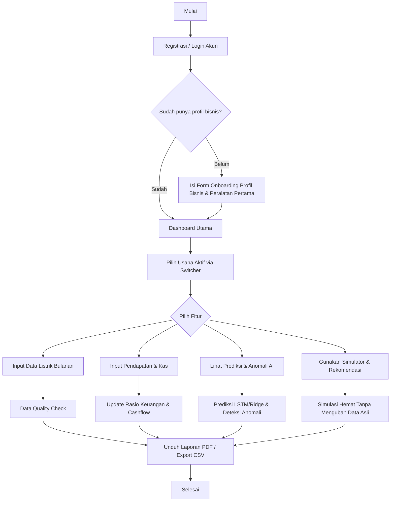
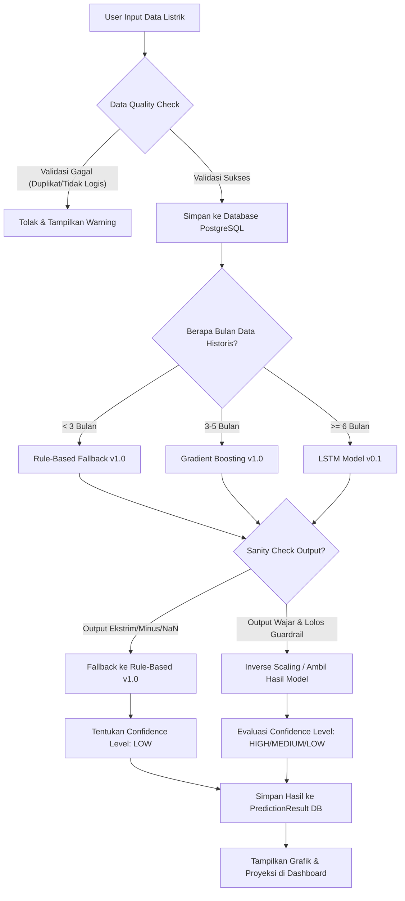
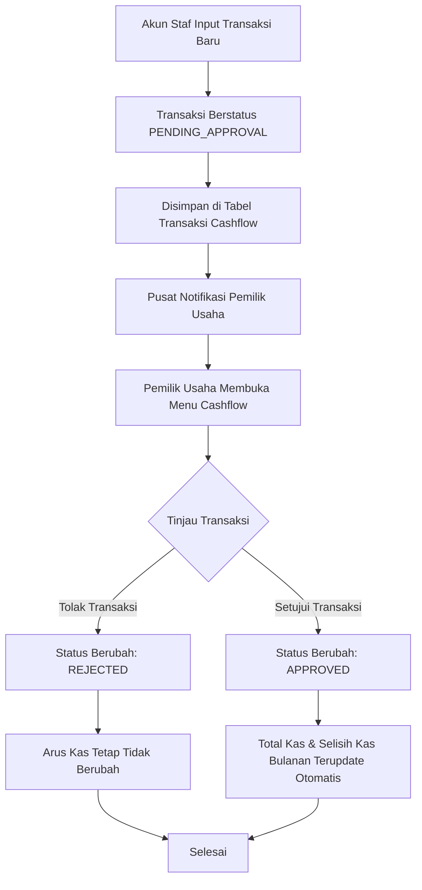

# ⚡ Laporan Lengkap & Panduan Pengguna WattWise AI
> **Asisten Hemat Listrik Berbasis AI untuk UMKM Indonesia**  
> *Listrik Lebih Cerdas, Biaya Lebih Terkendali.*

Laporan ini disusun untuk memberikan pemahaman menyeluruh tentang aplikasi **WattWise AI**, mulai dari panduan penggunaan, spesifikasi teknis, alur aplikasi (*application flow*), penjelasan bagaimana kecerdasan buatan (AI) diimplementasikan di balik layar, hingga potensi nilai bisnis dan daya jualnya di pasar.

---

## Daftar Isi
1. [Deskripsi Umum WattWise AI](#1-deskripsi-umum-wattwise-ai)
2. [Panduan Pemakaian Aplikasi (User Guide)](#2-panduan-pemakaian-aplikasi-user-guide)
   - [2.1. Registrasi & Login Pertama Kali (Demo Account)](#21-registrasi--login-pertama-kali-demo-account)
   - [2.2. Manajemen Multi-Bisnis (Multi-Business Switcher)](#22-manajemen-multi-bisnis-multi-business-switcher)
   - [2.3. Onboarding Usaha & Inventarisasi Peralatan](#23-onboarding-usaha--inventarisasi-peralatan)
   - [2.4. Input Data Listrik Bulanan & Data Quality Check](#24-input-data-listrik-bulanan--data-quality-check)
   - [2.5. Pencatatan Keuangan (Pendapatan & Listrik)](#25-pencatatan-keuangan-pendapatan--listrik)
   - [2.6. Manajemen Arus Kas & Persetujuan Transaksi (Cashflow)](#26-manajemen-arus-kas--persetujuan-transaksi-cashflow)
   - [2.7. Prediksi Tagihan Listrik (ML Predictions)](#27-prediksi-tagihan-listrik-ml-predictions)
   - [2.8. Deteksi Anomali Pemakaian (Anomaly Detection)](#28-deteksi-anomali-pemakaian-anomaly-detection)
   - [2.9. Rekomendasi Hemat Energi Cerdas (Smart Recommendations)](#29-rekomendasi-hemat-energi-cerdas-smart-recommendations)
   - [2.10. Simulasi Skenario Penghematan (Scenario Simulator)](#210-simulasi-skenario-penghematan-scenario-simulator)
   - [2.11. Riwayat Laporan & Cetak PDF / Export CSV](#211-riwayat-laporan--cetak-pdf--export-csv)
   - [2.12. Pusat Notifikasi & Profil Usaha](#212-pusat-notifikasi--profil-usaha)
   - [2.13. Integrasi WattWise AI Engine pada Dashboard Utama](#213-integrasi-wattwise-ai-engine-pada-dashboard-utama)
3. [Spesifikasi Teknis & Arsitektur Aplikasi](#3-spesifikasi-teknis--arsitektur-aplikasi)
   - [3.1. Tech Stack (Tumpukan Teknologi)](#31-tech-stack-tumpukan-teknologi)
   - [3.2. Arsitektur Aliran Data & Keamanan (Cookie Isolation)](#32-arsitektur-aliran-data--keamanan-cookie-isolation)
4. [Di Mana & Bagaimana Model AI Bekerja?](#4-di-mana--bagaimana-model-ai-bekerja)
   - [4.1. Filosofi Embedded AI (Zero-Cost Inference)](#41-filosofi-embedded-ai-zero-cost-inference)
   - [4.2. Siklus Pemodelan: Pelatihan Offline vs Inferensi Online](#42-siklus-pemodelan-pelatihan-offline-vs-inferensi-online)
   - [4.3. Model Utama: LSTM (LSTM UMKM v0.1)](#43-model-utama-lstm-lstm-umkm-v01)
   - [4.4. Model Tabular: Gradient Boosting Regression (Gradient Boosting UMKM v1.0)](#44-model-tabular-gradient-boosting-regression-gradient-boosting-umkm-v10)
   - [4.5. Model Baseline: Ridge Regression (Ridge UMKM v1.1)](#45-model-baseline-ridge-regression-ridge-umkm-v11)
   - [4.6. Mekanisme Hybrid Guardrail (Fallback & Sanity Check)](#46-mekanisme-hybrid-guardrail-fallback--sanity-check)
5. [Alur Aplikasi (Application Flow Charts)](#5-alur-aplikasi-application-flow-charts)
   - [5.1. Diagram Perjalanan Pengguna (User Journey)](#51-diagram-perjalanan-pengguna-user-journey)
   - [5.2. Diagram Pipeline Data & Prediksi AI](#52-diagram-pipeline-data--prediksi-ai)
   - [5.3. Diagram Alur Persetujuan Cashflow (Staff-Owner)](#53-diagram-alur-persetujuan-cashflow-staff-owner)
6. [Analisis Nilai Bisnis & Daya Jual (Business Case)](#6-analisis-nilai-bisnis--daya-jual-business-case)
   - [6.1. Masalah Utama UMKM (Pain Points)](#61-masalah-utama-umkm-pain-points)
   - [6.2. Solusi & Value Proposition](#62-solusi--value-proposition)
   - [6.3. Target Pasar (TAM, SAM, SOM)](#63-target-pasar-tam-sam-som)
   - [6.4. Model Bisnis & Monetisasi (Freemium SaaS, Kemitraan Vendor, Paket Audit)](#64-model-bisnis--monetisasi-freemium-saas-kemitraan-vendor-paket-audit)
7. [Kesimpulan & Roadmap Masa Depan](#7-kesimpulan--roadmap-masa-depan)
   - [7.1. Kesimpulan](#71-kesimpulan)
   - [7.2. Rencana Aksi (Roadmap MVP Tahap 3)](#72-rencana-aksi-roadmap-mvp-tahap-3)

---

## 1. Deskripsi Umum WattWise AI

**WattWise AI** adalah platform asisten efisiensi dan pemantauan energi berbasis kecerdasan buatan (AI) yang dirancang khusus untuk sektor **Usaha Mikro, Kecil, dan Menengah (UMKM) di Indonesia** (seperti usaha laundry, kuliner/F&B, ritel/minimarket, industri rumahan, bengkel, dan cold storage/penyimpanan beku). 

Banyak pemilik UMKM mengeluhkan biaya listrik bulanan yang tinggi dan fluktuatif tanpa memahami penyebab utamanya—apakah karena kerusakan alat, inefisiensi jam operasional, atau lonjakan pemakaian tak terduga. WattWise AI hadir sebagai solusi audit energi mandiri tanpa membutuhkan instalasi perangkat keras IoT (*smart meter*) yang mahal di tahap awal, melainkan mengoptimalkan pencatatan manual dan menganalisisnya secara cerdas.

---

## 2. Panduan Pemakaian Aplikasi (User Guide)

Bagian ini dirancang sebagai panduan praktis bagi pengguna baru maupun rekan-rekan tim Anda untuk memahami cara mengoperasikan seluruh fitur utama yang ada pada aplikasi WattWise AI.

### 2.1. Registrasi & Login Pertama Kali (Demo Account)
Untuk mempermudah pengujian tanpa harus registrasi dari awal, gunakan akun demo yang sudah terisi data histori yang realistis:
*   **Email:** `owner@wattwise.id`
*   **Password:** `password123`
*   *Langkah:* Buka halaman login utama di `/login`, masukkan kredensial di atas, lalu klik **Masuk**. Anda akan diarahkan ke halaman **Dashboard**. Jika ingin mendaftarkan akun baru, Anda dapat menuju menu `/register`.

### 2.2. Manajemen Multi-Bisnis (Multi-Business Switcher)
Salah satu fitur unggulan WattWise AI adalah mengelola lebih dari satu profil usaha dalam satu akun (misal: pemilik memiliki usaha laundry sekaligus frozen food).
1. Di bagian navigasi samping kiri dashboard (atau bar navigasi atas di tampilan mobile) seperti yang diatur pada berkas [dashboard-layout-client.tsx](file:///d:/LOMBA/Startup%20Proto/src/app/%28dashboard%29/dashboard/dashboard-layout-client.tsx), klik nama bisnis aktif yang terpilih (contoh: *Laundry Berkah*).
2. Pilih nama bisnis lain dari menu dropdown (contoh: *Frozen Jaya Purwokerto*).
3. Halaman dashboard, grafik, rekomendasi, hingga laporan bulanan akan otomatis berubah menyesuaikan profil bisnis yang aktif terpilih.

### 2.3. Onboarding Usaha & Inventarisasi Peralatan
Saat pertama kali menambahkan usaha baru atau ingin melakukan audit internal:
1. Buka menu **Tambah Usaha Baru** pada bilah navigasi samping kiri untuk mendaftarkan nama usaha, kategori (Laundry, F&B, Ritel, Manufaktur, Cold Storage, atau Lainnya), daya listrik (Volt Ampere / VA), dan jam operasional harian.
2. Buka menu **Peralatan** pada dashboard.
3. Klik tombol **Tambah Peralatan**.
4. Masukkan detail alat seperti: *Nama Alat* (misal: Mesin Pengering / Freezer / AC), *Kategori*, *Daya (Watt)*, *Jumlah Unit*, dan *Estimasi Jam Penggunaan Per Hari*.
5. Klik **Simpan**. Sistem akan langsung menghitung estimasi konsumsi kWh bulanan alat tersebut dan persentase kontribusinya terhadap total tagihan usaha. Kontribusi ini ditampilkan dalam diagram lingkaran (*pie chart*) interaktif.

### 2.4. Input Data Listrik Bulanan & Data Quality Check
Untuk menjaga keakuratan analisis AI, pengguna diharapkan mengisi data kWh meteran secara manual setiap bulannya:
1. Buka menu **Input Data** / **Tambah Catatan**.
2. Masukkan *Bulan* & *Tahun*, *Angka Pemakaian (kWh)* dari meteran PLN, dan *Total Biaya Tagihan (Rupiah)* yang tertera pada struk PLN seperti diatur pada berkas [electricity-form.tsx](file:///d:/LOMBA/Startup%20Proto/src/components/forms/electricity-form.tsx).
3. Klik **Simpan**. Sistem memiliki fitur **Data Quality Check** yang akan memvalidasi apakah angka yang Anda masukkan logis:
   - *Duplicate check:* Memblokir input jika kombinasi bulan dan tahun sudah terisi sebelumnya untuk usaha yang sama.
   - *Rasio Kewajaran:* Mendeteksi jika kWh sangat kecil namun biaya sangat besar atau sebaliknya (misal tarif melenceng jauh dari rata-rata batas wajar Rp1.350 - Rp1.700 per kWh).
   - *Lonjakan Ekstrem:* Memberikan notifikasi konfirmasi jika data pemakaian kWh naik >50% dibandingkan bulan sebelumnya untuk meminimalisasi salah ketik.

### 2.5. Pencatatan Keuangan (Pendapatan & Listrik)
Fitur ini memadukan data energi dengan indikator keuangan operasional UMKM:
1. Buka menu **Pendapatan & Listrik** pada dashboard yang diatur dalam berkas [pendapatan-client.tsx](file:///d:/LOMBA/Startup%20Proto/src/app/%28dashboard%29/dashboard/pendapatan/pendapatan-client.tsx).
2. Masukkan periode bulan & tahun, total pendapatan usaha (rupiah), serta catatan tambahan.
3. Gunakan menu *Advanced* jika ingin memasukkan nominal laba kotor, margin kotor (%), dan biaya operasional lainnya.
4. Klik **Simpan/Perbarui**. Sistem akan otomatis menghitung *electricity-to-revenue ratio* (Rasio Biaya Listrik terhadap Pendapatan) untuk menentukan apakah pengeluaran listrik memakan porsi margin keuntungan terlalu besar (skala: Sehat, Waspada, atau Kritis).

### 2.6. Manajemen Arus Kas & Persetujuan Transaksi (Cashflow)
WattWise AI dilengkapi dengan pembukuan arus kas sederhana yang mendukung kolaborasi bersama staf usaha:
1. Buka menu **Cashflow** pada dashboard yang diatur dalam berkas [cashflow-client.tsx](file:///d:/LOMBA/Startup%20Proto/src/app/%28dashboard%29/dashboard/cashflow/cashflow-client.tsx).
2. Anda dapat melihat ringkasan keuangan bulanan: Total Kas Masuk, Total Kas Keluar, Selisih Kas (Net Cashflow), dan status kesehatan arus kas (SEHAT, WASPADA, KRITIS).
3. Anda atau staf dapat menambahkan transaksi baru lewat form input dengan memilih arah kas (Masuk/Keluar), nominal, jenis kategori kas, dan status.
4. **Alur Persetujuan Staf:** Jika transaksi diinput oleh akun staf, transaksi akan berstatus `PENDING_APPROVAL`. Pemilik usaha (*Business Owner*) akan mendapatkan notifikasi dan wajib memeriksa daftar transaksi lalu mengklik **Setujui** atau **Tolak** di tabel transaksi untuk memperbarui arus kas resmi usaha.

### 2.7. Prediksi Tagihan Listrik (ML Predictions)
Prediksi ini membantu pemilik usaha mengantisipasi tagihan bulan berikutnya untuk perencanaan keuangan operasional:
1. Buka menu **Prediksi Tagihan** pada dashboard.
2. Jika belum memiliki prediksi untuk periode berikutnya, klik **Generate Prediksi Sekarang**.
3. Sistem akan memproses data historis melalui model AI dan memaparkan:
   - **Prediksi Pemakaian Listrik (kWh)** dan **Estimasi Tagihan (Rupiah)** untuk bulan depan.
   - **Tingkat Risiko Pemborosan** (Tinggi, Sedang, Rendah).
   - **Penyebab Utama Kenaikan** (misalnya pola konsumsi yang meningkat, jenis usaha musiman).
   - **Tingkat Kepercayaan Prediksi (Confidence Level)** beserta alasan latar belakangnya secara transparan.
   - **Grafik Proyeksi Pemakaian**: Grafik garis interaktif (Recharts) yang menampilkan garis hijau solid untuk pemakaian aktual harian, dan garis kuning putus-putus untuk proyeksi masa depan.

### 2.8. Deteksi Anomali Pemakaian (Anomaly Detection)
Mencegah tagihan bengkak akibat kebocoran arus listrik atau kelalaian penggunaan alat:
1. Buka menu **Deteksi Anomali**.
2. Anda akan melihat ringkasan kejadian anomali terbaru, dugaan kemungkinan penyebab (misalnya AC lupa dimatikan, freezer bocor karet pintu, mesin cuci digunakan berlebihan), serta taksiran dampak kerugian biaya (Rupiah).
3. Di bagian bawah terdapat tabel **Riwayat Deteksi Pemakaian** yang bisa disaring berdasarkan status: *Semua*, *Normal*, *Perlu Dicek*, atau *Boros*.

### 2.9. Rekomendasi Hemat Energi Cerdas (Smart Recommendations)
Aplikasi memberikan rekomendasi aksi praktis hemat listrik yang disesuaikan dengan jenis usaha Anda:
1. Buka menu **Rekomendasi Hemat**.
2. Sistem akan menampilkan daftar rekomendasi (misal untuk Laundry: menjadwalkan setrika batch, optimasi pengering; untuk Cold Storage: pengecekan karet gasket freezer 24 jam).
3. Tiap rekomendasi menampilkan estimasi penghematan nominal rupiah dan kWh per bulan, tingkat kesulitan (Mudah, Sedang, Sulit), prioritas (Tinggi, Sedang, Rendah), dan langkah-langkah praktis eksekusinya.
4. Klik **Terapkan** jika Anda sudah mengeksekusi rekomendasi tersebut. Sistem akan menandainya sebagai "Diterapkan" dan memperbarui nilai estimasi efisiensi pada laporan bulanan.

### 2.10. Simulasi Skenario Penghematan (Scenario Simulator)
Sebelum benar-benar mematikan alat atau membeli alat baru, Anda bisa melakukan uji coba simulasi dampak finansialnya:
1. Buka menu **Rekomendasi Hemat** atau menu **Simulator** jika tersedia.
2. Anda dapat melakukan simulasi di bagian Simulator dengan skenario seperti:
   - *Kurangi Jam Pakai:* Mengurangi jam operasional harian alat tertentu (misal: mengurangi pemakaian AC selama 2 jam per hari).
   - *Ganti Alat:* Mensimulasikan penggantian alat lama ke watt yang lebih kecil/teknologi inverter.
   - *Servis Rutin:* Mensimulasikan pembersihan filter AC atau defrost freezer yang meningkatkan efisiensi alat hingga 10-30%.
3. Sistem yang diatur pada berkas [scenario-simulator.ts](file:///d:/LOMBA/Startup%20Proto/src/services/scenario-simulator.ts) akan menghitung secara deterministik dan instan berapa **kWh yang dihemat** serta **jumlah uang (Rupiah) yang disimpan** per bulan tanpa mengubah data inventaris asli Anda.

### 2.11. Riwayat Laporan & Cetak PDF / Export CSV
1. Buka menu **Laporan**.
2. Anda akan melihat ringkasan laporan bulan berjalan, lengkap dengan grafik, skor efisiensi (*Energy Score*), rasio listrik terhadap pendapatan, serta daftar anomali terdeteksi.
3. Klik **Ekspor CSV** untuk mendownload riwayat data tagihan dan pemakaian dalam format CSV terstruktur.
4. Klik **Cetak Laporan PDF** untuk memicu *server-side rendering* PDFKit untuk menghasilkan dokumen laporan resmi (.pdf) secara instan, lengkap dengan stempel validasi WattWise AI untuk diarsipkan atau dipresentasikan ke mitra bisnis/investor.

### 2.12. Pusat Notifikasi & Profil Usaha
- **Notifikasi**: Klik ikon lonceng di bilah menu samping untuk melihat pusat notifikasi berisi alarm lonjakan pemakaian, instruksi pengisian data bulanan yang terlambat, atau status pembayaran paket.
- **Harga Paket & Profil Usaha**: Mengelola status keanggotaan bisnis Anda (Free, Pro UMKM, Business), melakukan upgrade paket melalui simulasi nomor Virtual Account (VA), dan memperbarui detail profil hukum usaha.

### 2.13. Integrasi WattWise AI Engine pada Dashboard Utama
Untuk memberikan transparansi penuh kepada pengguna (serta meningkatkan nilai jual kepada juri/investor), dashboard utama kini dilengkapi dengan panel khusus **WattWise AI Engine** yang memaparkan secara langsung kinerja kecerdasan buatan aplikasi:
1. **Status & Model AI Terpilih**: Menampilkan nama model ramah pengguna yang aktif (seperti *Rule-Based Estimation*, *Gradient Boosting Tabular Model*, atau *LSTM Sequence Model*), versi model, tingkat akurasi (Confidence Level: HIGH/MEDIUM/LOW), dan status penggunaan pengaman (*Hybrid Fallback*).
2. **Keterangan Penjelasan Pemilihan Model**: Memaparkan alasan logis mengapa model tersebut terpilih (misal: model LSTM aktif karena data historis $\ge$ 6 bulan).
3. **Faktor Inputs yang Dibaca AI**: Menampilkan 8 parameter input secara transparan (pemakaian bulan terakhir, pemakaian sebelumnya, rata-rata 3 & 6 bulan, tren persentase pemakaian, kategori jenis usaha, dan rata-rata tarif listrik).
4. **Grafik Aktual vs Prediksi AI**: Grafik garis interaktif kontinyu (Recharts) yang menghubungkan data aktual historis pemakaian (kWh) dengan titik estimasi pemakaian bulan depan secara visual.
5. **Panel Dampak Bisnis AI**: Menghitung estimasi tagihan listrik berjalan, potensi hemat bulanan dan tahunan, serta menyajikan kalkulasi *"Potensi Sisa Pendapatan Setelah Hemat"*.
6. **Tombol Navigasi / Callout Fallback**: Jika data prediksi belum pernah digenerate, panel akan menampilkan callout khusus untuk mengarahkan pengguna melakukan kalkulasi pertama kali ke halaman `/dashboard/prediksi`.

---

## 3. Spesifikasi Teknis & Arsitektur Aplikasi

WattWise AI dibangun dengan teknologi web modern yang tangguh untuk memastikan kecepatan akses dan keamanan data.

### 3.1. Tech Stack (Tumpukan Teknologi)
*   **Framework Utama:** Next.js 14.2.5 dengan App Router (untuk performa optimal, Server Actions, dan SEO ramah).
*   **Bahasa Pemrograman:** TypeScript 5.5 (menjamin keandalan tipe data).
*   **Desain UI & Styling:** Tailwind CSS 3.4 & Lucide Icons (desain responsif, modern, dan ramah pengguna).
*   **Akses Database (ORM):** Prisma Client v5.22.0.
*   **Database:** PostgreSQL (dihosting secara cloud di Supabase Cloud).
*   **Autentikasi:** NextAuth.js v4 dengan Credentials Provider (enkripsi password menggunakan `bcryptjs`).
*   **Library PDF & Grafik:** PDFKit (server-side rendering PDF) & Recharts (grafik interaktif).

### 3.2. Arsitektur Aliran Data & Keamanan (Cookie Isolation)

```
┌───────────────────────┐
│   Browser / Client    │  <-- Menampilkan grafik Recharts, simulator, & menu input
└──────────┬────────────┘
           │ (Server Actions & Secure API Routes)
           ▼
┌───────────────────────┐
│ Next.js Server Layer  │  <-- Memproses data, enkripsi sesi, & memanggil model AI (LSTM/Ridge)
└──────────┬────────────┘
           │ (Prisma Client ORM)
           ▼
┌───────────────────────┐
│ Supabase Cloud DB     │  <-- Menyimpan profil bisnis, data peralatan, & histori
└───────────────────────┘
```

> [!IMPORTANT]
> **Server-Side Cookie State Isolation:** Sesi bisnis aktif diamankan menggunakan cookie server (`wattwise_active_business_id`). Ini memastikan data usaha yang satu tidak akan bocor ke usaha lainnya meskipun dikelola oleh satu akun pengguna yang sama. Database query dibatasi menggunakan filter kepemilikan user ID (`userId`) di tingkat server untuk memperkuat keamanan (*defense-in-depth*).

---

## 4. Di Mana & Bagaimana Model AI Bekerja?

Ini adalah poin teknis penting yang sering menjadi pertanyaan: **Bagaimana model AI diimplementasikan tanpa server AI terpisah?**

### 4.1. Filosofi Embedded AI (Zero-Cost Inference)
Pada banyak aplikasi modern, istilah "AI" sering kali diidentikkan dengan chatbot interaktif atau API pihak ketiga (seperti OpenAI) yang lambat, mahal, dan membutuhkan koneksi internet tinggi. Di WattWise AI, **AI bekerja sebagai mesin inferensi tertanam (Embedded AI/Static Inference Engine)**. 

Model AI ditulis dalam format kode matematika murni di dalam Next.js (TypeScript). Hal ini membuat estimasi berjalan super cepat dalam hitungan milidetik (**< 1 ms**) tanpa biaya pemanggilan API eksternal dan tidak memiliki beban server tambahan.

### 4.2. Siklus Pemodelan: Pelatihan Offline vs Inferensi Online

```
[ PENGEMBANGAN OFFLINE (Python di folder ML/) ]
1. Pengumpulan Dataset (BDG2, ASHRAE, London LCL, Data Sintetis UMKM)
2. Pembersihan & Filter Fokus UMKM (Rentang 100 - 5.000 kWh/bulan)
3. Pelatihan Model (LSTM vs Ridge Regression vs Gradient Boosting)
4. Ekspor Bobot & Bias Matematika Model ke format JSON (Skrip 15 & 18)
                             │
                             ▼
[ PENERAPAN ONLINE (TypeScript di Next.js) ]
1. Tulis bobot & struktur model ke berkas 'lstm-umkm-model.ts', 'tabular-umkm-model.ts', & 'ridge-umkm-model.ts'
2. Saat user meminta prediksi -> Sistem melakukan routing sesuai panjang data historis & perhitungan inferensi sub-milidetik
3. Hasil estimasi ditampilkan pada grafik prediksi & disimpan ke database
```

### 4.3. Model Utama: LSTM (LSTM UMKM v0.1)
Model utama yang aktif untuk memprediksi pemakaian listrik bulanan adalah **Long Short-Term Memory (LSTM)**, yang sangat handal untuk menangkap hubungan sekuensial (runtun waktu) dan musiman pemakaian energi.

#### A. Spesifikasi Arsitektur Model LSTM
Model didefinisikan pada berkas [lstm-umkm-model.ts](file:///d:/LOMBA/Startup%20Proto/src/lib/prediction/lstm-umkm-model.ts) dengan struktur sebagai berikut:
*   **Panjang Rangkaian (Sequence Length):** 6 bulan (memerlukan minimal 6 data pemakaian historis berurutan).
*   **Fitur Input (10 Fitur):**
    1.  `latest_usage_kwh` (kWh bulan ini)
    2.  `previous_usage_kwh` (kWh bulan lalu)
    3.  `avg_3_month_usage_kwh` (rata-rata 3 bulan)
    4.  `avg_6_month_usage_kwh` (rata-rata 6 bulan)
    5.  `trend_1_month` (tren pemakaian dibanding bulan lalu)
    6.  `trend_3_month` (tren pemakaian dibanding rata-rata 3 bulan)
    7.  `month_sin` (Seasonality encoding - Sinus dari bulan berjalan)
    8.  `month_cos` (Seasonality encoding - Kosinus dari bulan berjalan)
    9.  `business_type_encoded` (Jenis usaha yang di-encode: Laundry=0, F&B=1, Ritel=2, Manufaktur=3, Cold Storage=4, Lainnya=6)
    10. `avg_tariff_idr_per_kwh` (tarif listrik per kWh)
*   **Lapisan Jaringan:**
    - Input Shape: `[6 timesteps, 10 features]`
    - Lapisan LSTM: 32 Hidden Units dengan aktivasi `tanh` dan aktivasi rekuren `sigmoid`.
    - Lapisan Dense Hidden: 16 Units dengan aktivasi `ReLU`.
    - Lapisan Dense Output: 1 Unit dengan aktivasi `linear`.
*   **Preprocessing:** Menggunakan StandardScaler (`input_scaler` dan `target_scaler`) yang bobot mean/scale-nya diekspor langsung dari Keras offline pipeline.

### 4.4. Model Tabular: Gradient Boosting Regression (Gradient Boosting UMKM v1.0)
Model tabular utama yang aktif untuk memprediksi pemakaian listrik bulanan pada fase data historis menengah (3 s/d 5 bulan) adalah **Gradient Boosting Regression**. Model ensemble ini didefinisikan pada berkas [tabular-umkm-model.ts](file:///d:/LOMBA/Startup%20Proto/src/lib/prediction/tabular-umkm-model.ts).

#### A. Spesifikasi Arsitektur Model Gradient Boosting:
*   **Algoritma:** `sklearn.ensemble.GradientBoostingRegressor` (pure TypeScript inference).
*   **Parameter Utama:**
    - Jumlah Estimator (`n_estimators`): 200 pepohonan keputusan (Decision Trees).
    - Tingkat Pembelajaran (`learning_rate`): `0.05`.
    - Nilai Awal (`init_value`): `978.0742289675441` (rata-rata bias awal).
*   **Fitur Input (11 Fitur):**
    1.  `business_type_encoded`
    2.  `month`
    3.  `latest_usage_kwh`
    4.  `previous_usage_kwh`
    5.  `avg_3_month_usage_kwh`
    6.  `avg_6_month_usage_kwh`
    7.  `trend_1_month`
    8.  `trend_3_month`
    9.  `month_sin`
    10. `month_cos`
    11. `avg_tariff_idr_per_kwh`

### 4.5. Model Baseline: Ridge Regression (Ridge UMKM v1.1)
Sebagai model pembanding dan baseline linier, WattWise AI memiliki model **Ridge Regression** dengan regularisasi L2 yang dideklarasikan pada berkas [ridge-umkm-model.ts](file:///d:/LOMBA/Startup%20Proto/src/lib/prediction/ridge-umkm-model.ts).

#### A. Rumus Inferensi Ridge Regression:

$$\text{Prediksi kWh} = \text{Intercept} + \sum (\text{Koefisien}_i \times \text{Fitur}_i)$$

*   **Intercept (Titik Potong):** `104.10710307364889`
*   **Koefisien Pengaruh Utama (Ridge Coefficients):**
    - `business_type_encoded`: `+13.646472143945566`
    - `month`: `-1.7983517725861613`
    - `latest_usage_kwh` (kWh bulan ini): `+0.8716166973225002` (berpengaruh positif paling kuat)
    - `previous_usage_kwh` (kWh bulan lalu): `+0.02552799231344214`
    - `avg_3_month_usage_kwh`: `-0.0691297957710631`
    - `avg_6_month_usage_kwh`: `+0.0228489013572503`
    - `trend_1_month`: `+0.36693568253024095`
    - `trend_3_month` (Tren 3 bulan): `-205.95021884390903` (berfungsi sebagai pengoreksi lonjakan ekstrem)
    - `month_sin` (Musiman Sin): `+4.141801853671001`
    - `month_cos` (Musiman Cos): `-12.866319209021267`
    - `avg_tariff_idr_per_kwh`: `-1.208858364005224e-22`

#### B. Perbandingan Metrik Performa Offline (Test Set):

| Metrik | Model Rule-Based (Fallback) | Model Ridge Regression | Model Gradient Boosting |
| :--- | :---: | :---: | :---: |
| **MAE (kWh)** | 211.31 | 177.14 | **154.04** |
| **RMSE (kWh)** | 476.30 | 406.46 | **370.74** |
| **sMAPE (%)** | 16.40% | 14.88% | **11.47%** |
| **wMAPE (%)** | 19.46% | 16.32% | **14.19%** |
| **Inference Time** | < 0.1 ms | **0.63 ms** | 1.85 ms |

### 4.6. Mekanisme Hybrid Guardrail (Fallback & Sanity Check)
Untuk memastikan keamanan prediksi dan mencegah model mengeluarkan angka minus atau anomali akibat ketidaklengkapan data historis, diimplementasikan sistem **Hybrid Guardrail** pada berkas [prediction.ts](file:///d:/LOMBA/Startup%20Proto/src/services/prediction.ts) dan [model-router.ts](file:///d:/LOMBA/Startup%20Proto/src/lib/prediction/model-router.ts):
1.  **Multi-Tier Model Routing (Berdasarkan Jumlah Data Historis):**
    - **Tingkat 1 (Rule-Based v1.0):** Jika data historis usaha < 3 bulan, model ML tidak dijalankan. Sistem menggunakan pendekatan *Rule-Based* (mengalikan pemakaian terakhir dengan tren 1 bulan terakhir yang dibatasi antara -20% hingga +20%, atau pertumbuhan default 2% jika data < 2 bulan).
    - **Tingkat 2 (Gradient Boosting v1.0):** Jika data historis usaha berjumlah 3 hingga 5 bulan, sistem memicu model tabular Gradient Boosting Regression.
    - **Tingkat 3 (LSTM v0.1):** Jika data historis usaha >= 6 bulan, model LSTM diaktifkan dengan urutan runtun waktu 6 bulan. (Untuk data >= 24 bulan, eligible untuk *Long-History Hook*).
2.  **Sanity Check Guardrail:** Jika model utama (LSTM atau Gradient Boosting) menghasilkan prediksi yang tidak wajar (di bawah 10 kWh, bernilai minus, bernilai NaN, di atas 3x pemakaian terakhir, atau di bawah 1/3 pemakaian terakhir akibat pola ekstrem), sistem akan menolaknya dan memicu status `HYBRID_FALLBACK` menggunakan algoritma *Rule-Based* demi menjaga stabilitas data visual.
3.  **Tingkat Kepercayaan (Confidence Level Evaluation):**
    - **Tinggi (HIGH):** Data historis lengkap (>= 6 bulan), tipe usaha dikenali (bukan `OTHER`), dan pola pemakaian stabil tanpa anomali terdeteksi.
    - **Sedang (MEDIUM):** Data historis lengkap (>= 6 bulan) namun tipe usaha `OTHER`, ATAU data historis 3-5 bulan (model Gradient Boosting) dengan tipe usaha dikenali dan pola pemakaian stabil.
    - **Rendah (LOW):** Terdeteksi lonjakan pemakaian abnormal (deviasi >40% dari rata-rata pemakaian historis), data historis < 3 bulan, atau terjadi kegagalan model (*fallback* ke *Rule-Based*).

---

## 5. Alur Aplikasi (Application Flow Charts)

Berikut adalah diagram alur visual untuk membantu tim memahami alur data dan proses di dalam WattWise AI.

### 5.1. Diagram Perjalanan Pengguna (User Journey)



### 5.2. Diagram Pipeline Data & Prediksi AI



### 5.3. Diagram Alur Persetujuan Cashflow (Staff-Owner)



---

## 6. Analisis Nilai Bisnis & Daya Jual (Business Case)

WattWise AI bukan sekadar proyek pemrograman biasa, melainkan memiliki potensi ekonomi dan nilai komersial yang tinggi untuk dipasarkan sebagai produk startup mandiri.

### 6.1. Masalah Utama UMKM (Pain Points)
1.  **Beban Operasional (OPEX) Tinggi:** Listrik adalah salah satu biaya terbesar kedua setelah gaji karyawan bagi usaha berdaya menengah seperti laundry (pengering daya besar) dan cold storage (mesin pendingin 24 jam).
2.  **Keterbatasan Pengetahuan Energi:** Pelaku UMKM tidak mengerti peralatan mana yang boros dan bagaimana menjadwalkan operasional alat agar hemat biaya.
3.  **Mahalnya Jasa Auditor & Alat Smart Meter:** Layanan audit energi profesional berkisar antara Rp5-15 juta, dan instalasi IoT smart meter membutuhkan biaya besar di awal, yang sangat sulit dijangkau oleh pelaku usaha mikro.

### 6.2. Solusi & Value Proposition WattWise AI
*   **Tanpa Biaya Perangkat Keras (Zero Hardware Cost):** Menawarkan analisis cerdas hanya bermodalkan input manual data meteran PLN yang sudah ada.
*   **Analisis yang Disesuaikan Jenis Usaha:** Aplikasi memahami pola laundry berbeda dengan cold storage, sehingga memberikan rekomendasi yang sangat personal dan relevan.
*   **Dampak Finansial dalam Rupiah:** Konversi dari kWh ke Rupiah mempermudah pebisnis memahami nilai kehematan operasional secara langsung.

### 6.3. Target Pasar (Market Sizing)
*   **TAM (Total Addressable Market):** Seluruh UMKM di Indonesia (~64 juta unit usaha).
*   **SAM (Serviceable Addressable Market):** UMKM berdaya menengah ke atas (di atas 1300 VA) seperti laundry, kuliner/F&B, minimarket, cold storage, fotokopi, dan bengkel di Jawa Tengah.
*   **SOM (Serviceable Obtainable Market):** Tahap awal ditargetkan pada komunitas UMKM lokal di wilayah **Banyumas (Purwokerto dan sekitarnya)** menggunakan jaringan kemitraan dinas koperasi setempat.

### 6.4. Model Bisnis & Monetisasi (Revenue Model)
Jika ingin dikomersialkan, platform ini dapat menghasilkan pendapatan melalui:
1.  **Model Freemium SaaS (Langganan Bulanan):**
    *   **Free Tier (Gratis):** Fitur pencatatan 1 profil usaha, dashboard dasar, input listrik manual, dan rekomendasi hemat energi dasar.
    *   **Pro UMKM Tier (Estimasi Rp15.000 - Rp29.000/bulan):** Mendukung multi-usaha, akses Prediksi Pintar Energi (LSTM/Gradient Boosting), Appliance Classifier (klasifikasi peralatan), rekomendasi hemat energi lanjutan, dan cetak laporan PDF resmi.
    *   **Business Tier (Estimasi Rp49.000 - Rp79.000/bulan):** Seluruh fitur Pro ditambah dukungan multi-cabang usaha, ekspor data CSV terstruktur, laporan bulanan mendalam, prioritas dukungan pelanggan, dan akses fitur pilot (uji coba fitur baru).
2.  **Affiliate & Vendor Kemitraan (Lead Generation):**
    *   WattWise AI bertindak sebagai perantara yang mempertemukan UMKM ber-peralatan boros dengan vendor barang hemat energi (seperti AC inverter, freezer hemat energi, atau panel surya mikro), lalu mendapatkan persentase komisi penjualan (*affiliate fee*).
3.  **Paket Audit Energi Semi-Digital:**
    *   Menyediakan jasa kunjungan lapangan murah berkolaborasi dengan mahasiswa teknik elektro lokal untuk membantu inventarisasi peralatan awal secara presisi, yang kemudian diintegrasikan ke sistem WattWise AI.

---

## 7. Kesimpulan & Roadmap Masa Depan

### 7.1. Kesimpulan
WattWise AI berhasil menjembatani kebutuhan efisiensi operasional pelaku UMKM dengan solusi cerdas berbasis perangkat lunak. Keunikan sistem AI yang ditanam langsung (*embedded*) di Next.js memberikan keunggulan berupa performa inferensi super cepat (< 1 ms), biaya operasional server yang mendekati nol, dan keandalan sistem karena didukung pengamanan *Hybrid Guardrail*.

### 7.2. Rencana Aksi (Roadmap MVP Tahap 3)
*   **Integrasi IoT Smart Plug Murah:** Menyediakan opsi konektivitas plug-and-play dengan steker pintar komersial murah (Rp70.000-an) untuk merekam data pemakaian alat-alat utama secara otomatis.
*   **PLN OCR Reader:** Menambahkan fitur pemindaian foto angka meteran listrik PLN menggunakan kamera handphone berbasis Computer Vision (OCR) untuk menghindari kesalahan input manual.
*   **Notifikasi WhatsApp & Telegram:** Mengirim pengingat pengisian bulanan otomatis dan alarm peringatan instan jika sistem mendeteksi lonjakan pemakaian abnormal.
*   **Enterprise Dashboard Chains:** Menyediakan dashboard khusus bagi bisnis waralaba (franchise) untuk memantau efisiensi energi di seluruh cabang toko mereka dalam satu layar.

---
> **Pernyataan Penyangkalan (Disclaimer):**  
> *Seluruh data konsumsi energi, nilai estimasi tagihan listrik bulanan, kalkulasi emisi karbon, prediksi tingkat kehematan, dan peringatan anomali di dalam aplikasi WattWise AI bersifat estimasi simulasi berdasarkan data input pengguna dan bukan merupakan tagihan atau laporan resmi dari PT PLN (Persero). Aplikasi WattWise AI tidak berafiliasi dengan PT PLN (Persero).*
