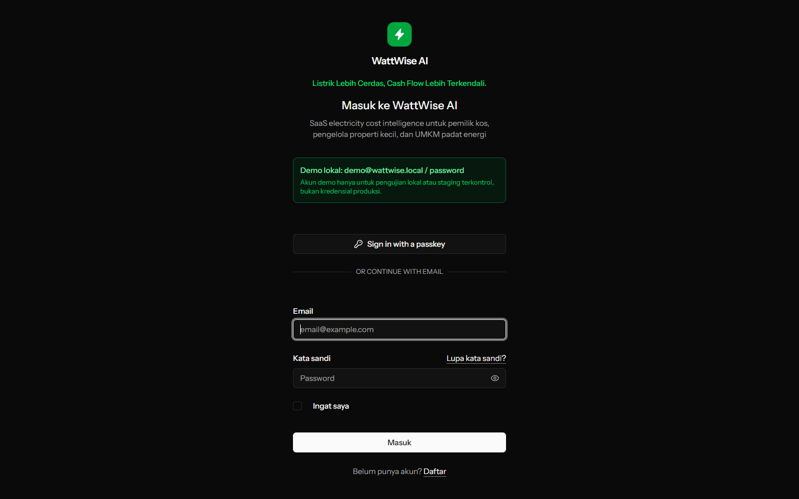
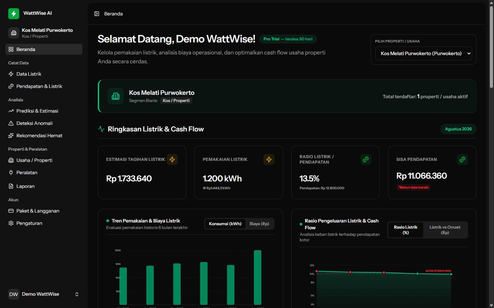
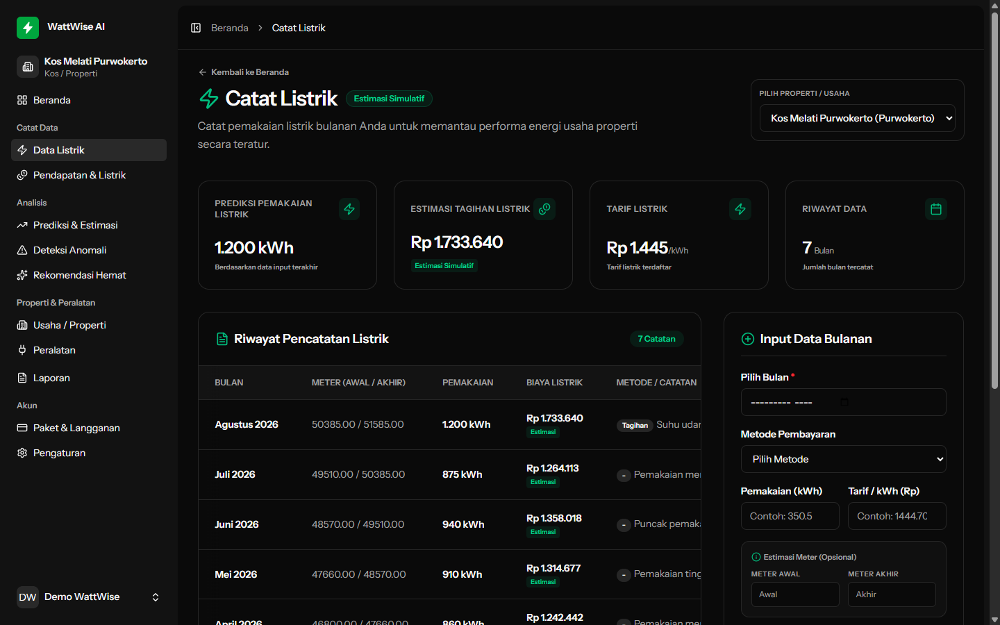
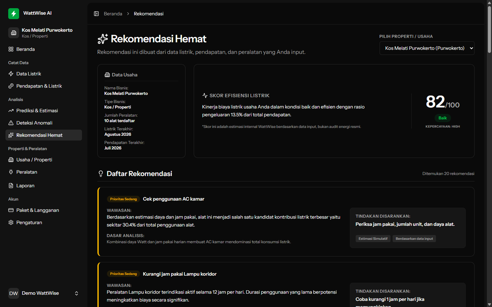
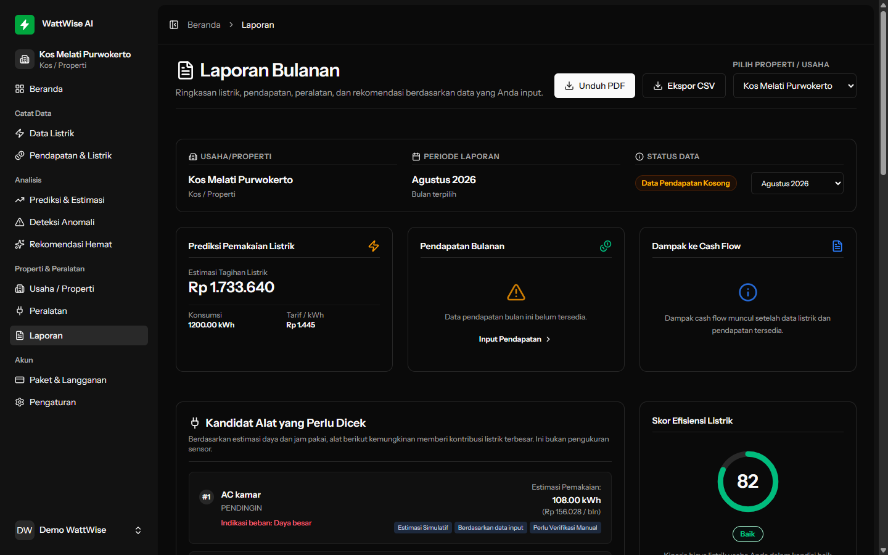
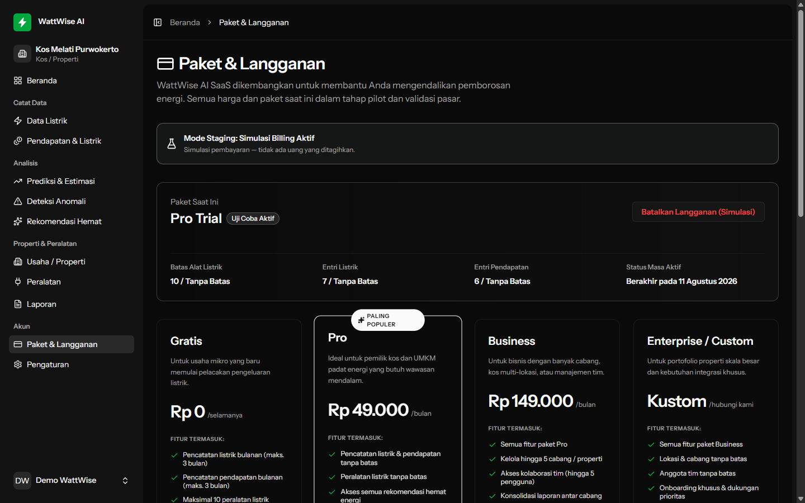
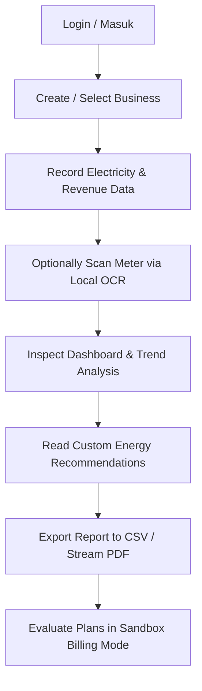

# WattWise AI

> **SaaS Electricity Cost Intelligence untuk Pemilik Kos & Properti Sewa**  
> *Energy intelligence assistant for Indonesian small businesses to monitor consumption, estimate costs, detect anomalies, and generate actionable reports.*

---

## 1. Product Overview / Gambaran Umum Produk
**WattWise AI** adalah asisten intelijen efisiensi energi berbasis web yang dirancang khusus untuk pemilik properti kos, akomodasi sewa, dan UMKM padat energi di Indonesia. Platform ini membantu pelaku usaha mencatat konsumsi listrik secara mandiri (manual maupun OCR), memvisualisasikan tren biaya, memproyeksikan tagihan berjalan secara transparan, mendeteksi anomali pemakaian, serta merekomendasikan langkah penghematan praktis guna mengamankan arus kas bisnis.

---

## 2. Problem Being Solved / Masalah yang Diselesaikan
* **Kebocoran Arus Kas (Cash Flow Leakage):** Pemilik kos sering kali mengalami lonjakan tagihan listrik akibat pemakaian berlebih oleh penyewa (misalnya AC yang menyala 24 jam) atau kerusakan alat elektronik (misalnya kebocoran kulkas/freezer) tanpa disadari hingga tagihan akhir bulan membengkak.
* **Mahalnya Biaya Audit Energi:** Pelaku usaha mikro dan kecil tidak memiliki anggaran untuk menyewa jasa auditor energi profesional atau membeli infrastruktur IoT (Smart Metering) yang mahal.
* **Keterbatasan Pencatatan Manual:** Penggunaan buku fisik atau spreadsheet sederhana menyulitkan analisis tren prediktif, deteksi dini anomali, dan pembuatan laporan formal untuk mitra bisnis.

---

## 3. MVP Status / Status Minimum Viable Product
Aplikasi WattWise AI saat ini berada pada tahap **MVP (Minimum Viable Product)** yang sepenuhnya fungsional dan dideploy pada lingkungan staging. Beberapa fitur integrasi pihak ketiga (seperti WhatsApp gateway dan gerbang pembayaran) berjalan dalam mode simulasi/log untuk keperluan demonstrasi aman.
* **Active MVP Implementation:** `wattwise-laravel` (Laravel 11, Vue 3, Inertia.js, TypeScript, Tailwind CSS, PostgreSQL).
* **Legacy next.js Context:** Kode Next.js yang berada di root direktori saat ini telah **diarsipkan (archived)** dan hanya digunakan sebagai dokumentasi historis serta referensi riset.

---

## 4. Live Staging Demo / Tautan Demo Live
Aplikasi MVP dideploy secara otomatis ke lingkungan staging:
* 🌐 **Staging / Private Beta Demo:** [https://start-up-repo-staging.up.railway.app](https://start-up-repo-staging.up.railway.app)
* 🩺 **Staging Health Check `/up`:** [https://start-up-repo-staging.up.railway.app/up](https://start-up-repo-staging.up.railway.app/up)

> [!NOTE]
> * **Data Simulasi:** Lingkungan demo ini hanya menggunakan data simulasi/dummy dan database dapat di-reset sewaktu-waktu.
> * **Akses Demo:** Detail akun demo disediakan secara terpisah kepada penguji beta (beta testers) dan juri kompetisi demi keamanan data.

---

## 5. Screenshots / Tampilan Aplikasi

Berikut adalah dokumentasi antarmuka aplikasi WattWise AI MVP yang diambil langsung dari server staging:

### 1. Landing & Login Experience
Halaman masuk untuk akses demo dan penguji private beta.


### 2. Main Dashboard
Pusat kendali operasional yang memantau total konsumsi (kWh), biaya riil, rasio listrik terhadap pendapatan, serta skor efisiensi energi.


### 3. Electricity Entry & Meter OCR
Formulir pencatatan data listrik manual dengan modul pembacaan angka meteran menggunakan kamera (browser-local OCR).


### 4. Equipment recommendations
Saran taktis penghematan daya listrik berdasarkan jenis alat elektronik yang terdaftar pada profil usaha.


### 5. PDF & CSV Reports
Riwayat laporan bulanan yang dapat diekspor langsung ke format CSV dan diunduh sebagai dokumen laporan formal PDF.


### 6. Sandbox Subscription Plans
Halaman pemilihan paket langganan WattWise dengan modul simulasi pembayaran sandbox yang aman.


---

## 6. Core Features / Fitur Utama
* **Multi-Business Context:** Kelola banyak properti/usaha (misalnya *Kos Melati Purwokerto* dan *Frozen Jaya*) dalam satu akun dengan isolasi data yang aman pada sisi server (`wattwise_active_business_id`).
* **Electricity & Revenue Tracking:** Catat pemakaian kWh meteran, daya listrik terpasang (VA), nominal tagihan bulanan, serta omzet usaha untuk menghitung rasio biaya listrik.
* **Appliance Inventory:** Manajemen inventaris peralatan elektronik per properti untuk memetakan beban konsumsi terbesar.
* **Browser-Local Meter OCR:** Scan foto angka meteran listrik langsung di peramban tanpa mengirim file gambar ke server eksternal, menjaga efisiensi bandwidth dan privasi data.
* **CSV & PDF Export:** Unduh riwayat data dalam format CSV untuk analisis spreadsheet mandiri atau cetak laporan bulanan berformat PDF formal.
* **Sandbox Billing Simulator:** Coba fitur premium dengan gerbang pembayaran tiruan (*simulation-only*) tanpa melibatkan transaksi uang riil.
* **WhatsApp Log-Only Monthly Reminders:** Pengingat bulanan otomatis yang disimulasikan melalui log server untuk mendemonstrasikan kesiapan fitur notifikasi.

---

## 7. Product Flow / Alur Penggunaan Produk
Alur penggunaan aplikasi WattWise AI digambarkan dalam diagram berikut:



---

## 8. Technology Stack / Stack Teknologi Aktif
Aplikasi WattWise AI MVP menggunakan teknologi modern, handal, dan berorientasi performa:
* **Backend:** Laravel 11 & PHP 8.3 (dengan validasi skema DB yang ketat)
* **Frontend:** Vue 3 (Composition API), Inertia.js, TypeScript, & Tailwind CSS
* **Database:** PostgreSQL (dihosting di cloud staging via Supabase/Railway)
* **OCR Engine:** Tesseract.js (dijalankan client-side di dalam peramban web)
* **PDF Generator:** Streamed PDF generator pada sisi server untuk meminimalkan beban memori
* **Deployment Platform:** Railway Cloud Staging

---

## 9. Current Prediction & AI Capabilities / Kapabilitas Prediksi & AI Saat Ini
* **Explainable Forecasting (Deterministic):** Prediksi tagihan bulan berikutnya dihitung menggunakan algoritma *Weighted Moving Average* (kombinasi data historis dengan bobot bulan terdekat) serta *Linear Trend Projection* untuk memetakan arah pertumbuhan konsumsi.
* **Deterministic Anomaly & Risk Signals:** Pendeteksi anomali cerdas membandingkan deviasi konsumsi berjalan terhadap baseline historis 3 bulan sebelumnya untuk mengeluarkan peringatan otomatis jika terjadi lonjakan pemakaian yang tidak wajar.
* **Rule-Based Energy Recommendations:** Mesin rekomendasi taktis menganalisis profil peralatan elektronik aktif, daya listrik terpasang (VA), dan jenis usaha untuk menyusun tips penghematan daya yang realistis.

> [!IMPORTANT]
> **Riset ML Lanjutan (Research Artifacts Only):**
> Model ML tingkat lanjut seperti LSTM (Long Short-Term Memory), Ridge Regression, dan Tree-Based Ensemble (XGBoost/LightGBM) yang terdapat di direktori `ML/` dan legacy Next.js saat ini merupakan **artefak riset dan benchmark**. Model-model ini disiapkan sebagai kandidat evaluasi masa depan setelah pengumpulan data historis pelanggan berjalan selama fase private-beta, guna dibandingkan dengan baseline deterministik.

---

## 10. Architecture / Arsitektur Sistem
Aplikasi ini diarsitekturi dengan prinsip isolasi data (data-scoping) yang ketat per unit bisnis aktif:

```
[ Browser Client Vue 3 / Inertia.js ]
         │
         ▼ (HTTPS / Inertia Requests with CSRF & Session Validation)
[ Laravel Application Server ]
         │
         ├──► Active Business Scoping Middleware
         ├──► FeatureGateService (Plan Authorization)
         └──► Server-Side PDF Streamer
         │
         ▼ (PostgreSQL Client Connection)
[ PostgreSQL Database (Staging Pooler) ]
```

1. **Inertia.js Protocol:** Menjembatani frontend Vue 3 dan backend Laravel secara mulus tanpa memerlukan REST API terpisah, memelihara validitas session state dan proteksi CSRF.
2. **Active Business Scoping:** Middleware server-side mengunci seluruh kueri database ke dalam konteks `active_business_id` aktif untuk menjamin keamanan multi-tenant.
3. **Local OCR Processing:** Pemrosesan gambar Tesseract.js dilakukan sepenuhnya pada peramban klien, menghemat sumber daya komputasi server.

---

## 11. Safety & Security Boundaries / Batasan Keamanan & Keselamatan
* **Sandbox Payments:** Pembayaran untuk peningkatan paket menggunakan simulator sandbox, tidak menerima kartu kredit asli atau uang riil.
* **Log-Only WhatsApp:** Pengiriman pesan WhatsApp tidak terhubung ke gateway API berbayar. Seluruh notifikasi dikirimkan ke dalam log sistem (`storage/logs/laravel.log`) untuk diaudit secara lokal.
* **Explainable AI Guardrails:** Seluruh algoritma proyeksi dan deteksi anomali dilengkapi pengaman (*Sanity Check Guardrails*) untuk mencegah hasil nilai negatif, NaN, atau estimasi ekstrim akibat anomali data masukan.
* **Zero Production Credentials:** Kredensial database, kunci rahasia aplikasi (`APP_KEY`), token eksternal, dan kata sandi administratif diisolasi melalui variabel lingkungan Railway dan tidak di-commit ke dalam repositori.

---

## 12. Local Development / Panduan Setup Lokal
Untuk menjalankan dan menguji aplikasi `wattwise-laravel` secara lokal:

### Prerequisites
* PHP >= 8.2 (dengan ekstensi `pdo_sqlite`, `mbstring`, `xml` diaktifkan)
* Composer
* Node.js >= 18 & NPM

### Langkah Setup
1. **Pindah ke Direktori Laravel:**
   ```bash
   cd wattwise-laravel
   ```
2. **Instalasi Dependensi:**
   ```bash
   composer install
   npm install
   ```
3. **Konfigurasi Environment:**
   Salin file konfigurasi contoh:
   ```bash
   copy .env.example .env
   ```
4. **Generate App Key:**
   ```bash
   php artisan key:generate
   ```
5. **Migrasi Database & Seeding Lokal:**
   Secara default, konfigurasi lokal menggunakan database SQLite demi kemudahan setup:
   ```bash
   php artisan migrate --seed
   ```
6. **Jalankan Vite Dev Server (Frontend):**
   ```bash
   npm run dev
   ```
7. **Jalankan Laravel Local Server (Backend):**
   Buka terminal baru di direktori yang sama dan jalankan:
   ```bash
   php artisan serve
   ```
   Aplikasi lokal dapat diakses di `http://127.0.0.1:8000`.

---

## 13. Testing & Quality Gates / Pengujian & Mutu
Kualitas kode pada rilis `v0.3-rc2` divalidasi secara lokal sebelum dideploy melalui gerbang pengujian berikut:
* **Backend Tests:** 537 pengujian backend berhasil diselesaikan dengan 3,618 assertions.
* **Static Analysis:** PHPStan level 7 (zero errors).
* **Code Formatting:** Laravel Pint (PHP) & ESLint + Prettier (Vue/TS) berhasil lolos tanpa peringatan format.
* **Type Checking:** Pengujian tipe TypeScript strict (`vue-tsc --noEmit`) berhasil diselesaikan.
* **OCR Parser Tests:** Unit test khusus untuk parser hasil pembacaan Tesseract.js.
* **Build Validation:** Vite production bundler berhasil membangun aset tanpa error.
* **Composer Audit:** Nol kerentanan keamanan terdeteksi pada dependensi php.

---

## 14. Deployment / Skema Deployment
Aplikasi ini dideploy ke **Railway Staging** menggunakan skema Git-based deployment yang dipicu secara otomatis oleh commit baru pada branch `main`.
* GitHub Actions sengaja tidak digunakan untuk repositori ini demi efisiensi resource. Validasi mutu dijalankan secara lokal secara ketat sebelum proses commit/push, dan health check otomatis dijalankan oleh sistem Railway saat startup kontainer.

---

## 15. Current Release / Rilis Saat Ini
* **Rilis Staging Saat Ini:** [v0.3-rc2](https://github.com/hanif-12-01/start-up-repo/releases/tag/v0.3-rc2)
* Tag rilis dikunci secara historis dan tidak boleh diubah atau dipindahkan tanpa koordinasi tim.

---

## 16. Private-Beta Roadmap / Rencana Pengembangan
* **v0.3-rc2 (Current):** Staging MVP Candidate dengan isolasi data multi-business dan sandbox billing.
* **Fase Private-Beta:** Ujicoba terbatas pada 5–10 bisnis lokal (pemilik kos di Purwokerto) untuk mengumpulkan data pemakaian energi riil dan umpan balik pengguna.
* **v0.3.x:** Stabilisasi aplikasi, penyesuaian fungsional berdasarkan masukan beta, dan perbaikan bug.
* **v0.4-beta:** Peningkatan UX onboarding profil usaha baru dan perbaikan performa client-side OCR.
* **Fase Beta Lanjutan:** Evaluasi performa model ML (LSTM/Ridge) menggunakan data historis yang terkumpul dibandingkan dengan performa baseline deterministik.
* **v1.0 (Production Launch):** Integrasi gerbang pembayaran riil, WhatsApp API resmi, dan peluncuran komersial setelah validasi operasional selesai.

---

## 17. Repository Structure / Struktur Repositori
* `ML/` — Artefak riset dan notebook eksperimen machine learning (LSTM, Gradient Boosting, dll).
* `docs/` — Spesifikasi produk, diagram arsitektur, checklist QA manual, dan gambar dokumentasi (`docs/images/`).
* `references/` — Catatan referensi desain dan standar penulisan kode.
* `scripts/` — Skrip bantu pengembangan lokal.
* `wattwise-laravel/` — **Codebase Aktif Aplikasi MVP (Laravel + Vue 3/Inertia).**
* `src/`, `prisma/`, `next.config.mjs` (dll) — **[ARCHIVED]** Codebase Next.js historis.

---

## 18. Disclaimer / Penyangkalan Resmi
> **Pernyataan Penyangkalan (Disclaimer):**  
> 1. Proyeksi tagihan listrik bulanan, kalkulasi emisi karbon, rekomendasi penghematan daya, dan peringatan anomali yang dihasilkan oleh WattWise AI bersifat **estimasi simulasi belaka** dan bukan merupakan tagihan/laporan resmi dari PT PLN (Persero).
> 2. Aplikasi ini **TIDAK terhubung secara resmi** dengan sistem pintar smart-metering atau infrastruktur Advanced Metering Infrastructure (AMI) milik PT PLN (Persero). Segala keputusan bisnis yang diambil berdasarkan rekomendasi platform ini sepenuhnya menjadi tanggung jawab mandiri pengguna.

---
*Dibuat oleh Tim Pengembang WattWise AI.*
