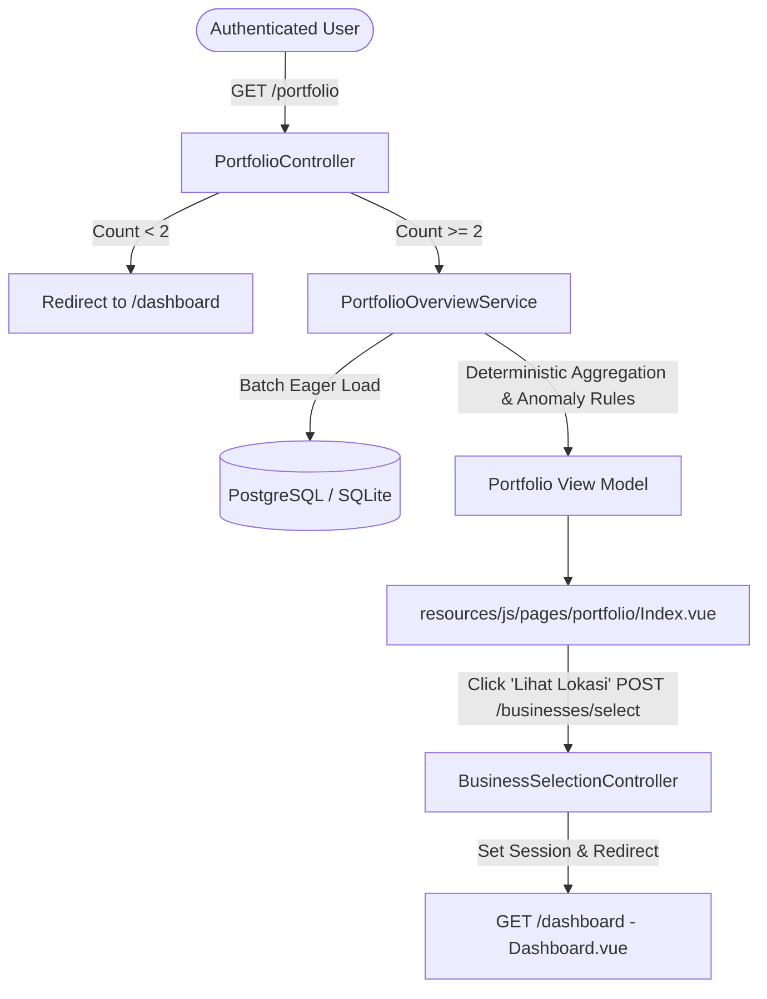

# IT-P0-09: Multi-Location Portfolio Command Center

**Status:** Implemented  
**Reference PR:** `feat(portfolio): add multi-location command center`  
**Target Application:** `wattwise-laravel/` (Reference/Production parity baseline)  
**Primary Route:** `GET /portfolio` (`portfolio.index`)

---

## 1. Problem Statement & Background

Many Indonesian UMKM and multi-location operators (juragan kos, laundry franchise owners, F&B multi-branch owners, cold-storage operators) manage between 2 and 50+ locations. Previously, WattWise was strictly scoped to a single active business at a time. To inspect multiple locations, an owner had to manually toggle the business selector and review each dashboard individually.

This created high cognitive friction and violated the primary operational need of multi-unit owners: **Manage by Exception**. Owners should not need to check every healthy location every day; they only need to know:
1. **Level 1 (Portfolio):** *"Lokasi mana yang perlu saya perhatikan?"* (Where is the problem?)
2. **Level 2 (Location):** *"Kenapa lokasi ini perlu diperhatikan?"* (Why did it happen?)

---

## 2. Product Principles & Architecture

### Core Philosophy
> *"Portfolio Dashboard untuk mengetahui DI MANA masalahnya. Dashboard Lokasi untuk mengetahui KENAPA masalahnya terjadi."*

- **Manage by Exception:** Prominently highlight anomalous or data-deficient locations while summarizing healthy locations calmly.
- **Decision Support, Not Mechanical Claim:** Never claim equipment failure, electrical leakage, fraud, or official PLN measurements. Use safe wording: *Aman*, *Perlu Dicek*, *Perlu Perhatian*, and *Data Belum Lengkap*.
- **Preserve Existing Location Dashboard:** `DashboardController` and `Dashboard.vue` remain completely intact as the Level 2 root-cause investigation view.
- **Dedicated Read Model:** Built as an isolated read pipeline (`PortfolioController` $\rightarrow$ `PortfolioOverviewService` $\rightarrow$ `Portfolio/Index.vue`) without polluting `DashboardController` with multi-tenant aggregation loops.



---

## 3. Route & Navigation Behavior

### Route Contract
- **Endpoint:** `GET /portfolio`
- **Route Name:** `portfolio.index`
- **Middleware:** `['auth', 'verified', 'journey']`
- **Security & Tenant Isolation:**
  - Strictly scopes queries to `$request->user()->businesses()->active()`.
  - Archived or deleted businesses are excluded.
  - Zero GET-side database mutations or session overwrites.
  - Query parameter: `?month=YYYY-MM` (validates format, defaults to latest month with electricity data or current calendar month).

### Single vs. Multi-Location Behavior
1. **0 Active Businesses:**
   - Captured by existing `journey` middleware $\rightarrow$ Redirects to `/onboarding`.
2. **1 Active Business:**
   - `/portfolio` safely redirects to `/dashboard` (`302`).
   - Sidebar displays standard single-location navigation ("Beranda" $\rightarrow$ `/dashboard`).
3. **$\ge 2$ Active Businesses:**
   - `/portfolio` renders the Portfolio Command Center.
   - Sidebar displays grouped navigation under **Ringkasan**:
     - **Semua Usaha** $\rightarrow$ `/portfolio`
     - **Dashboard Lokasi** $\rightarrow$ `/dashboard`
   - Business switcher includes an explicit **"Semua Usaha"** shortcut linking to `/portfolio`.

---

## 4. Aggregation, Data Coverage, & MoM Comparison Rules

### Selected Calendar Month Semantics
- Comparison across locations is strictly synchronized to the **same calendar month** (`YYYY-MM`).
- WattWise never mixes disparate months (e.g. Location A in July + Location B in August) into a single aggregate total.

### Visible Data Coverage & Zero Fabrication
- **Rule:** Missing data is **never** fabricated as zero consumption (`0 kWh != missing record`).
- Every aggregate metric and chart tooltip discloses exact coverage:
  - `active_locations`: Total active businesses owned by the user.
  - `locations_with_electricity`: Locations with recorded electricity for the selected month.
  - `locations_with_revenue`: Locations with recorded revenue for the selected month.
  - `electricity_coverage_percent`: `(locations_with_electricity / active_locations) * 100`
  - `revenue_coverage_percent`: `(locations_with_revenue / active_locations) * 100`

### Electricity Cost Resolution
Following existing WattWise business logic:
1. Prefer `bill_amount_idr`.
2. Fallback only if `bill_amount_idr` is null or zero: `usage_kwh * tariff_per_kwh` (if tariff $> 0$).

### Month-over-Month (MoM) Comparison Rules
- Compares the selected month (`YYYY-MM`) with the previous calendar month (`YYYY-(MM-1)`).
- **Population Integrity:** MoM delta percentage is calculated **strictly on the subset of locations that have valid data in both months** (`comparable_location_count`).
- If population coverage differs between months, the interface explicitly notes:
  *"Perbandingan berdasarkan X lokasi dengan data lengkap di dua bulan."*

---

## 5. Health Status & Safe Wording Mapping

To ensure strict alignment with core anomaly detection without duplicating magic numbers, `PortfolioOverviewService` references authoritative thresholds from `App\Services\Anomalies\AnomalyService`:
- `THRES_BOROS = 20.0` ($\ge 20\%$ increase vs historical baseline)
- `THRES_DICEK = 10.0` ($10\% - 19.9\%$ increase vs historical baseline)

### User-Facing Safe Wording Matrix
| Internal Anomaly Status | Portfolio Label | Description / Safe Reason | Badge Style |
| :--- | :--- | :--- | :--- |
| `Normal` | **Aman** | *"Pemakaian masih berada dalam pola yang wajar berdasarkan data yang tersedia."* | Emerald / Green |
| `Perlu Dicek` | **Perlu Dicek** | *"Pemakaian meningkat dibanding pola sebelumnya. Ada baiknya lokasi ini diperiksa."* | Amber / Yellow |
| `Boros` | **Perlu Perhatian** | *"Pemakaian meningkat cukup besar dibanding pola sebelumnya."* | Rose / Red |
| No Data / Null Entry | **Data Belum Lengkap** | *"Data bulan ini belum cukup untuk menilai kondisi lokasi."* | Slate / Gray |

*Disclaimer included on all portfolio views:*  
> *"Indikasi ini berdasarkan data yang dicatat di WattWise dan bukan diagnosis teknis instalasi listrik."*

---

## 6. "Yang Perlu Anda Perhatikan" (Exceptions Priority)

The command center features an exception stream limited to a maximum of 5 cards, sorted strictly by urgency:
1. **Priority 1:** `Perlu Perhatian` (highest positive electricity cost delta / percentage first)
2. **Priority 2:** `Perlu Dicek` (highest positive electricity cost delta / percentage first)
3. **Priority 3:** `Data Belum Lengkap` (missing electricity entry for selected month)
4. *Normal / Aman locations are completely excluded from this section.*

Each exception card includes:
- Location name, business type, and city (if set).
- Simple status badge.
- Plain-language reason and quantified impact (e.g. `+Rp420.000 (+22%)`).
- Cost vs. Revenue context (e.g. *"Biaya listrik naik lebih cepat daripada pendapatan"*).
- Direct drill-down action CTA: **[Lihat Lokasi]** or **[Lengkapi Data]**.

---

## 7. Drill-Down Flow (Level 1 $\rightarrow$ Level 2)

When an owner clicks **"Lihat Lokasi"** from any card or table row:
1. An Inertia POST request is dispatched to `POST /businesses/select`.
2. The payload contains `business_id` and `redirect_to: '/dashboard'`.
3. `BusinessSelectionController` validates ownership (`user_id === auth()->id()`) and active status.
4. Active business is updated in session (`active_business_id`).
5. User is redirected to `/dashboard` showing the existing individual business dashboard for detailed diagnostic investigation.

---

## 8. Query Design & N+1 Performance Safety

`PortfolioOverviewService` is designed to support 50+ businesses within an O(1) query complexity budget:
- **Batch Eager Loading:**
  ```php
  $businesses = $user->businesses()
      ->active()
      ->with([
          'electricityProfile',
          'electricityEntries' => fn ($q) => $q->whereIn('period_month', $trendMonths)->orderByDesc('period_month'),
          'revenueEntries' => fn ($q) => $q->whereIn('period_month', $trendMonths)->orderByDesc('period_month'),
      ])
      ->get();
  ```
- **In-Memory Aggregation:** All aggregations, MoM deltas, and 6-month historical trend calculations are performed on the eagerly loaded Eloquent collection in memory.
- **Query Count Regression Guard:** Verified via `tests/Feature/PortfolioTest.php`: for 20 active businesses, total query count remains under 15 queries (observed: 9 queries).

---

## 9. Verification & Test Evidence

### Automated Test Matrix
File: `wattwise-laravel/tests/Feature/PortfolioTest.php`
- `test_unauthenticated_user_cannot_access_portfolio`: Returns 302 to `/login`.
- `test_zero_business_user_redirected_to_onboarding`: Journey middleware redirects to `/onboarding`.
- `test_single_business_user_redirected_to_dashboard`: 1 business redirects to `/dashboard`.
- `test_multi_business_user_can_view_portfolio`: 2+ businesses loads `portfolio/Index`.
- `test_portfolio_excludes_archived_businesses`: Archived businesses never appear.
- `test_portfolio_never_exposes_other_users_businesses`: Strict tenant isolation.
- `test_portfolio_aggregates_same_selected_month_only`: No multi-month cross-contamination.
- `test_missing_data_is_not_fabricated_as_zero`: Coverage counters accurate, missing $\ne 0$.
- `test_bill_fallback_calculation_when_bill_amount_missing`: Uses `usage_kwh * tariff_per_kwh`.
- `test_mom_comparison_uses_comparable_locations_only`: Population mismatch disclosed.
- `test_health_status_mapping_and_authoritative_thresholds`: Normal $\rightarrow$ Aman, Dicek $\rightarrow$ Perlu Dicek, Boros $\rightarrow$ Perlu Perhatian.
- `test_attention_items_ordering_and_max_limit`: Max 5 cards, ordered by severity and magnitude.
- `test_drill_down_selection_mechanism_updates_active_business`: Session updated, redirected to `/dashboard`.
- `test_portfolio_six_month_trend_preserves_coverage_counts`: Coverage tracked per month.
- `test_portfolio_query_count_does_not_explode_with_many_businesses`: Guard for 20 locations $< 15$ queries.

**Test Results:**
```
PASS  Tests\Feature\PortfolioTest
✓ unauthenticated user cannot access portfolio
✓ zero business user redirected to onboarding
✓ single business user redirected to dashboard
✓ multi business user can view portfolio
✓ portfolio excludes archived businesses
✓ portfolio never exposes other users businesses
✓ portfolio aggregates same selected month only
✓ missing data is not fabricated as zero
✓ bill fallback calculation when bill amount missing
✓ mom comparison uses comparable locations only
✓ health status mapping and authoritative thresholds
✓ attention items ordering and max limit
✓ drill down selection mechanism updates active business
✓ portfolio six month trend preserves coverage counts
✓ portfolio query count does not explode with many businesses

Tests: 15 passed (173 assertions)
```

Existing Regression Suites:
- `Tests\Feature\WattWiseDemoSeederTest`: 13 passed (140 assertions).
- `Tests\Feature\DemoLoginFlowTest`: 3 passed (7 assertions).

### Code Style & Types
- `vendor/bin/pint --test`: Clean (0 violations).
- `npx vue-tsc --noEmit`: Clean (0 errors across `portfolio/Index.vue`, `AppSidebar.vue`, `BusinessSwitcher.vue`).

---

## 10. UI & Visual QA Matrix

Tested against standard viewports (360x800, 375x812, 768x1024, 1024x768, 1440x900, 1920x1080):
- **Desktop (1920x1080):** Full multi-column dashboard, KPI summary cards, health status banner, 2-column exception grid, 6-month historical trend bar chart, searchable and filterable table with interactive sorting and drill-down CTAs.
- **Mobile (375x812):** Responsive stacked layout, horizontal swipe/scroll prevention, stacked location cards replacing dense tables, sticky filters.
- **Accessibility:** Semantic headings (`<h1>`, `<h2>`), high-contrast badges, keyboard focus rings, full screen-reader and color-blind distinguishable statuses (icon + label + text).

---

## 11. Known Limitations & Future Work
1. **Centralized Post-Login Redirect:** In accordance with Section 3, login redirect remains at `/dashboard` to preserve Fortify and demo test contracts. For multi-location users, `/portfolio` is placed as the primary top destination in the sidebar and business switcher. A post-login smart routing mechanism can be evaluated as a follow-up.
2. **Chart Customization:** Trend chart displays the last 6 months with coverage disclosures. Custom date-range picking is intentionally out of scope for MVP.
