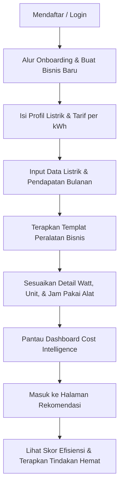
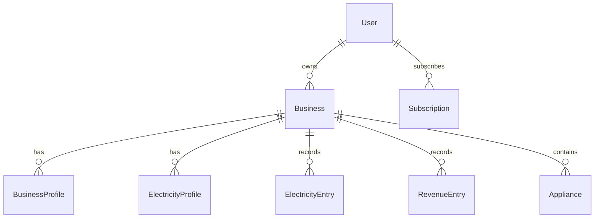

# Product Requirements Document (PRD): WattWise AI

---

## 1. Product Summary
**WattWise AI** adalah platform SaaS *electricity cost intelligence* (kecerdasan biaya listrik) yang dirancang khusus untuk pemilik kos, pengelola properti sewa skala kecil, dan pelaku UMKM padat energi (seperti usaha laundry, F&B/kuliner, minimarket, dan cold storage).

Dengan tagline **“Listrik Lebih Cerdas, Cash Flow Lebih Terkendali”**, WattWise AI membantu pelaku usaha non-teknis memahami konsumsi listrik mereka, menghubungkan biaya listrik dengan pendapatan operasional bulanan, mendeteksi peralatan listrik mana yang berpotensi menjadi penyedot daya terbesar, serta memberikan rekomendasi tindakan hemat energi yang praktis. 

Untuk pasar awal (*initial wedge*), WattWise AI memfokuskan penetrasi pada pemilik kos-kosan, kontrakan, dan properti sewa kecil di kota-kota universitas/kampus (seperti Purwokerto) sebelum beralih ke UMKM padat energi di area yang lebih luas.

---

## 2. Problem Statement
Banyak pelaku usaha kecil dan pemilik properti menyadari bahwa tagihan listrik bulanan mereka sangat tinggi dan memakan porsi besar dari pengeluaran bulanan mereka. Namun, mereka menghadapi kendala-kendala berikut:
* **Buta Informasi Kontribusi Alat**: Tidak tahu peralatan mana yang sebenarnya mengonsumsi daya listrik paling besar di lokasi bisnis mereka.
* **Biaya vs. Pendapatan**: Kesulitan melacak secara historis bagaimana fluktuasi biaya listrik bulanan secara langsung memengaruhi sisa margin pendapatan (*net cash flow*).
* **Kurang Pengetahuan Praktis**: Bingung mencari cara menghemat biaya listrik tanpa harus memasang alat sensor yang mahal atau memerlukan pengetahuan kelistrikan yang rumit.
* **Tergantung Estimasi Manual**: Perhitungan manual menggunakan Excel sering kali membingungkan, tidak terstruktur, dan tidak memberikan tindak lanjut wawasan (*actionable insight*).

---

## 3. Target Users
WattWise AI menargetkan beberapa kategori pengguna berikut:
1. **Pemilik Kos / Kontrakan**: Mengelola 10–30 kamar kos atau kamar sewa, yang tagihan listriknya sering kali ditanggung pemilik atau disatukan dalam paket sewa.
2. **Pengelola Properti Kecil**: Mengelola apartemen studio sewa harian/bulanan atau homestay.
3. **Pemilik Usaha Laundry (Jasa Cuci)**: Menjalankan mesin cuci, mesin pengering berdaya tinggi, dan setrika listrik sepanjang hari.
4. **Operator F&B (Restoran, Kafe, Warung Makan)**: Mengoperasikan penanak nasi (*rice cooker*), dispenser air panas/dingin, kulkas, blender, dan kompor listrik secara terus-menerus.
5. **Pemilik Toko Retail / Minimarket**: Menggunakan pencahayaan penuh, pendingin ruangan (AC), *showcase cooler*, serta sistem kasir berjam-jam.
6. **Pelaku Cold Storage / Frozen Food**: Menjalankan *chest freezer* dan *chiller* 24 jam nonstop untuk mengawetkan bahan makanan mentah.

---

## 4. Primary Persona
* **Nama**: Pak Budianto (52 tahun)
* **Pekerjaan**: Pemilik Kos 24 Kamar di sekitar Kampus Universitas Jenderal Soedirman (Unsoed), Purwokerto.
* **Karakteristik**:
  * Non-teknikal (jarang menggunakan aplikasi rumit, terbiasa dengan WhatsApp dan pencatatan kertas/Excel sederhana).
  * Menginginkan pengelolaan keuangan kos yang rapi karena kos-kosan merupakan sumber pendapatan utama masa pensiunnya.
  * Sering mengeluh karena tagihan listrik bulanan kos melonjak tiba-tiba (akibat penggunaan AC, dispenser, atau penanak nasi oleh anak kos) tanpa bisa melacak kamar/peralatan mana yang boros.
  * Membutuhkan solusi cepat untuk melihat sisa keuntungan bersih setiap bulannya setelah dipotong tagihan listrik.

---

## 5. Product Goals
* **Penyederhanaan Data Listrik**: Memudahkan pengguna non-teknis melihat dan memahami tren tagihan serta konsumsi kWh listrik bulanan.
* **Kecerdasan Rasio Biaya**: Menghubungkan pengeluaran listrik dengan pendapatan usaha secara visual untuk memantau kesehatan *cash flow*.
* **Identifikasi Konsumsi Alat**: Memberikan perkiraan kontribusi beban listrik tiap peralatan (Watt, jumlah unit, durasi pakai) agar pengguna memiliki gambaran prioritas verifikasi.
* **Rekomendasi Hemat Berbasis Aturan**: Menyajikan rekomendasi hemat listrik yang mudah dimengerti dan diaplikasikan tanpa membutuhkan instalasi perangkat keras (hardware).
* **Mendukung Keputusan Finansial**: Membantu pengguna mengambil keputusan taktis bulanan (seperti menaikkan tarif kamar kos, mengganti tipe AC, atau membatasi penggunaan dispenser oleh penyewa).

---

## 6. Non-Goals
Untuk menjaga ekspektasi dan integritas hukum produk, WattWise AI secara tegas **tidak menyatakan**:
* Sebagai aplikasi tagihan resmi PLN atau pengganti PLN Mobile.
* Sebagai pengganti audit energi profesional bersertifikat.
* Mampu melakukan pengukuran tingkat alat secara presisi/eksak (*exact device-level measurement*).
* Mampu mendeteksi secara real-time melalui sensor fisik atau smart plug (kecuali simulasi/integrasi opsional di masa depan).
* Mampu mendeteksi kerusakan spesifik (*broken/malfunctioning appliance*) dari suatu alat secara otomatis.
* Mampu menjamin 100% kebenaran penyebab anomali listrik bulanan tanpa verifikasi fisik di lapangan.

---

## 7. MVP Scope
Fitur minimal yang harus diimplementasikan pada versi awal (MVP) meliputi:
1. **Autentikasi Pengguna**: Login, registrasi, verifikasi email, dan pengaturan profil.
2. **Onboarding Terpandu**: Alur awal pengenalan aplikasi dan pengisian profil bisnis pertama bagi user baru.
3. **Manajemen Usaha (Business Profile)**: Pencatatan identitas bisnis, alamat, dan segmentasi tipe bisnis aktif.
4. **Pencatatan Listrik Bulanan (Electricity Entries)**: Input periodik tagihan listrik (Rupiah), kWh, stand meter awal/akhir, dan tarif per kWh.
5. **Pencatatan Pendapatan Bulanan (Revenue Entries)**: Input pendapatan bulanan kotor untuk analisis rasio efisiensi.
6. **Templat Peralatan (Appliance Templates)**: Pilihan templat instan alat-alat listrik bawaan berdasarkan jenis segmen bisnis guna mempercepat input.
7. **Kelola Peralatan (Appliance CRUD)**: Pengelolaan manual peralatan listrik (nama alat, kategori, daya Watt, jumlah unit, jam pakai per hari, hari pakai per bulan).
8. **Dashboard Utama**: Ringkasan visual kesehatan energi, sisa pendapatan, rasio biaya, peringkat alat terboros, serta widget insight ringkas.
9. **Halaman Rekomendasi**: Analisis rule-based lengkap mengenai pola boros, kelengkapan data, skor efisiensi listrik, dan simulasi skenario penghematan.

---

## 8. Core User Journey

1. **Registrasi**: User baru mendaftar menggunakan email atau Google Auth.
2. **Onboarding**: User dipandu mengisi nama bisnis, kota operasional, jenis bisnis (misal: Kos/Properti), dan tarif dasar listrik.
3. **Pencatatan Data Bulanan**: User menginput tagihan listrik terakhir dan total pendapatan kotor bulan berjalan.
4. **Penyusunan Peralatan**: User memilih opsi "Terapkan Templat Kos" untuk memunculkan daftar peralatan default (AC, Kulkas, Lampu, Pompa Air), lalu menyesuaikan daya Watt dan rata-rata durasi pakainya.
5. **Dashboard & Analisis**: User melihat rasio biaya listrik terhadap pendapatan, sisa kas bersih setelah dikurangi listrik, serta 3 peralatan teratas yang terindikasi mengonsumsi daya terbesar.
6. **Rekomendasi & Tindakan**: User membuka halaman rekomendasi, mengevaluasi Skor Efisiensi Listrik, membaca skenario simulasi hemat ("jika AC dimatikan 1 jam/hari..."), dan mencetak atau mengikuti rekomendasi tersebut di lapangan.

---

## 9. Key Features

| Fitur | Nilai Pengguna (User Value) | Perilaku Dasar (Basic Behavior) | Data yang Dibutuhkan | Prioritas MVP |
| :--- | :--- | :--- | :--- | :--- |
| **Onboarding** | Pengisian profil cepat tanpa kebingungan. | Mengisi form bisnis dan profil listrik dasar saat pertama kali login. | Nama bisnis, tipe bisnis, kota, daya listrik (VA), tarif. | HIGH |
| **Electricity Tracking** | Melacak pengeluaran listrik bulanan secara historis. | User menginput tagihan bulanan atau stand meter bulanan. | Bulan periode, Rupiah tagihan, kWh, stand meter, tarif. | HIGH |
| **Revenue Tracking** | Memantau dampak biaya listrik pada keuntungan kotor. | User menginput pendapatan kotor bulanan usaha secara teratur. | Bulan periode, jumlah Rupiah pendapatan, status estimasi. | HIGH |
| **Appliance Templates** | Menghemat waktu input peralatan listrik. | Sekali klik untuk menambahkan daftar peralatan standar industri kos/UMKM. | Tipe bisnis, daftar nama peralatan standar, default Watt/jam. | HIGH |
| **Appliance Estimation** | Mengetahui estimasi konsumsi kWh & biaya tiap alat. | Menghitung matematis bulanan konsumsi kWh dan rupiah per alat. | Watt alat, kuantitas, jam pakai/hari, hari pakai/bulan, tarif kWh. | HIGH |
| **Dashboard Summary** | Mendapatkan visualisasi performa bisnis seketika. | Menampilkan widget biaya, rasio, sisa kas, diagram lingkaran beban alat. | Entri listrik terbaru, pendapatan terbaru, estimasi beban alat. | HIGH |
| **Recommendations** | Panduan hemat energi yang mudah ditindaklanjuti. | Evaluasi rule-based yang membagi wawasan ke level prioritas (High/Med/Low). | Data tagihan, rasio, data peralatan, profil tarif listrik. | HIGH |
| **Plans & Trial** | Mencoba fitur premium secara gratis tanpa komitmen awal. | Akses gratis 30 hari untuk fitur Pro, membatasi dashboard pada plan Gratis. | Status pendaftaran user, timestamp onboarding. | HIGH |
| **Basic Reports** | Dokumentasi dan arsip laporan ringkas. | Menampilkan halaman rangkuman bersih bulanan yang siap cetak ramah browser. | Seluruh data historis bisnis berjalan. | MEDIUM |

---

## 10. AI / Intelligence Positioning
WattWise AI menggunakan pendekatan **Hybrid AI Decision Support** (Dukungan Keputusan AI Hibrida):
* **Fase Awal (MVP / Weeks 1-4)**: Sepenuhnya digerakkan oleh **Mesin Aturan (Rule-Based Engine)** yang matang dan kalkulasi matematis deterministik. Ini menjamin kecepatan build, paritas logika, stabilitas sistem, dan biaya operasional $0 untuk API eksternal.
* **Fase Lanjutan**: Evaluasi model LSTM lokal (*Local LSTM*) untuk peramalan beban listrik atau deteksi anomali musiman berdasarkan data historis pengguna tanpa mengirimkan data ke penyedia AI luar (menjaga privasi data).
* **Posisi Komunikasi**: Aplikasi diposisikan sebagai asisten analisis data cerdas (*intelligent parser*) yang memberikan panduan berdasarkan estimasi matematis dari parameter input pengguna, bukan "AI generatif" yang berhalusinasi atau memberikan jaminan angka mutlak.

---

## 11. Safe Wording Rules
Untuk menghindari kesalahpahaman informasi yang dapat berujung pada komplain hukum oleh pengguna (misal: perbedaan hasil estimasi dengan tagihan riil dari PLN), antarmuka WattWise AI **wajib mematuhi pedoman bahasa berikut**:

### Kosakata yang Diwajibkan (Wajib Digunakan):
* **“Prediksi pemakaian listrik”** (digunakan untuk estimasi volume energi dalam kWh).
* **“Estimasi tagihan listrik”** (digunakan untuk nilai rupiah biaya listrik).
* **“Estimasi Simulatif”** (menegaskan bahwa angka merupakan hasil hitungan simulasi).
* **“Kandidat alat yang perlu dicek”** (bukan menuduh alat tersebut pasti rusak/boros).
* **“Perlu verifikasi manual”** (mendorong user melakukan inspeksi fisik).
* **“Berdasarkan data yang Anda input”** (menghubungkan hasil dengan akurasi input user).

### Kosakata yang Dilarang (Jangan Pernah Digunakan):
* *penyebab pasti* (diganti dengan: "kemungkinan pemicu / indikasi kuat")
* *alat rusak / alat bocor* (diganti dengan: "alat dengan konsumsi daya tidak biasa")
* *konsumsi aktual* (diganti dengan: "estimasi konsumsi")
* *sensor membaca / terdeteksi real-time* (karena tidak ada integrasi IoT fisik pada MVP)
* *AI memastikan / sistem menjamin*

---

## 12. Required Disclaimers
Sanggahan (disclaimer) berikut harus diletakkan pada bagian footer halaman dashboard, halaman estimasi peralatan, dan halaman wawasan rekomendasi:

> [!IMPORTANT]
> **Disclaimer Tagihan & PLN**
> *“Prediksi dan estimasi WattWise AI bersifat perkiraan berdasarkan data yang dimasukkan pengguna dan bukan tagihan resmi PLN. WattWise AI bukan aplikasi resmi PLN, bukan pengganti PLN Mobile, dan bukan alat ukur listrik resmi.”*

> [!NOTE]
> **Disclaimer Pengukuran Peralatan**
> *“Perhitungan peralatan berdasarkan data daya dan jam pakai yang Anda input. Tanpa sensor fisik, WattWise AI tidak mengukur konsumsi aktual tiap alat. Konsumsi daya riil dapat bervariasi berdasarkan merk, usia alat, dan cara pemakaian.”*

> [!WARNING]
> **Disclaimer Margin Keuangan**
> *“Sisa pendapatan setelah listrik belum memperhitungkan biaya operasional bisnis lainnya seperti bahan baku, gaji karyawan, biaya sewa tempat, air, internet, pajak, penyusutan aset, dan biaya-biaya operasional lainnya.”*

---

## 13. Data Model Overview
Secara konseptual, relasi basis data WattWise AI Laravel rewrite dibangun di atas tabel-tabel berikut:

1. **`users`**: Menyimpan kredensial dasar dan status keanggotaan pengguna.
2. **`businesses`**: Merepresentasikan entitas bisnis/properti aktif milik pengguna (Tenant Isolation Key).
3. **`business_profiles`**: Informasi tambahan seperti kategori bisnis, jumlah karyawan, dan jam operasional bisnis.
4. **`electricity_profiles`**: Konfigurasi listrik bisnis seperti daya terpasang (VA), metode pembayaran (prabayar/pascabayar), tipe meteran, dan tarif per kWh default.
5. **`electricity_entries`**: Riwayat pencatatan bulanan tagihan listrik, stand meter, tarif berjalan, dan volume kWh.
6. **`revenue_entries`**: Riwayat pencatatan bulanan total pendapatan kotor bisnis.
7. **`appliances`**: Daftar peralatan listrik yang terdaftar di dalam bisnis (tiap baris mencatat daya watt, kuantitas, rata-rata jam/hari, hari/bulan, dan sumber input).
8. **`subscriptions`**: Mencatat paket langganan aktif, tanggal kedaluwarsa, dan status uji coba (*trial*).

---

## 14. Plans & Trial Rules
WattWise AI menyusun strategi monetisasi freemium dengan skema paket berikut:

### 1. Paket Gratis (Free Plan)
* **Harga**: Rp 0 / selamanya.
* **Fitur**:
  * Akses ke 1 profil bisnis aktif.
  * Pencatatan manual listrik bulanan dan pendapatan (maksimal histori 3 bulan terakhir).
  * Dashboard dasar (rasio listrik, sisa pendapatan, kWh volume).
  * CRUD peralatan listrik secara manual (tanpa templat instan).
  * Rekomendasi dasar (hanya menampilkan isu berkategori kelengkapan data).

### 2. Paket Pro (Pro Plan)
* **Harga**: Paket berlangganan bulanan terjangkau (untuk pemilik kos/UMKM kecil).
* **Fitur**:
  * Akses hingga 3 profil bisnis aktif.
  * Histori pencatatan bulanan tak terbatas.
  * Akses penuh ke pustaka **Appliance Templates** (Templat Peralatan Instan).
  * Akses ke **Skor Efisiensi Listrik** dan wawasan analisis alat lengkap (prioritas tinggi/sedang/ringan).
  * Simulasi skenario penghematan biaya secara detail per peralatan.
  * Cetak laporan bulanan ramah browser (PDF print layout).

### 3. Paket Business (Business Plan)
* **Harga**: Langganan bulanan menengah.
* **Fitur**:
  * Akses hingga 10 profil bisnis aktif.
  * Seluruh fitur Pro.
  * Kemampuan ekspor data ke file CSV/Excel.
  * Konsolidasi multi-bisnis/multi-kos pada satu layar dashboard ringkasan.

### 4. Paket Enterprise / Custom
* **Harga**: Berdasarkan penawaran khusus.
* **Fitur**:
  * Jumlah profil bisnis/kos tak terbatas.
  * Integrasi data kustom dan konsultasi efisiensi energi.

### Aturan Uji Coba (Trial Rules):
* Setiap pengguna baru yang menyelesaikan onboarding mendapatkan **Pro Trial 30 Hari** secara otomatis tanpa perlu memasukkan kartu kredit/metode pembayaran terlebih dahulu.
* Selama masa uji coba, seluruh fitur Paket Pro terbuka penuh untuk memfasilitasi validasi manfaat produk oleh pengguna.
* Setelah 30 hari, jika tidak melakukan upgrade berbayar, akun otomatis diturunkan (*downgraded*) ke Paket Gratis secara aman tanpa menghapus data historis yang sudah diinput sebelumnya (hanya membatasi tampilan visual dan memblokir akses ke fitur premium).

---

## 15. Success Metrics
* **Tingkat Penyelesaian Onboarding (Onboarding Completion Rate)**: Persentase pengguna terdaftar yang berhasil menyelesaikan pengisian profil bisnis pertama (> 85%).
* **Pencatatan Berulang (Monthly Entry Retention)**: Jumlah pengguna yang secara aktif kembali menginput data listrik dan pendapatan di bulan berikutnya (> 60%).
* **Adopsi Templat (Template Adoption Rate)**: Persentase pengguna yang menggunakan fitur apply templat peralatan dibanding input manual (> 70%).
* **Kuantitas Peralatan (Appliances Added per Business)**: Rata-rata jumlah peralatan listrik yang berhasil didaftarkan per properti/bisnis (target: minimal 5 alat untuk hasil analisis optimal).
* **Aktivitas Analisis (Recommendation View Rate)**: Persentase kunjungan pengguna ke halaman rekomendasi setelah melakukan pencatatan bulanan (> 50%).
* **Konversi Trial (Trial-to-Paid Conversion)**: Persentase pengguna uji coba Pro yang melakukan upgrade ke paket berbayar setelah 30 hari (> 3%).

---

## 16. Roadmap

### Phase 1: Core MVP (Current Phase)
* Fokus pada Laravel rewrite: fondasi autentikasi, isolasi data penyewa (*tenant isolation*), pencatatan tagihan listrik dan pendapatan, pengelolaan peralatan via templat segmen bisnis, Skor Efisiensi Listrik dasar, dan halaman rekomendasi rule-based.

### Phase 2: Automation & Engagement (Next Step)
* **Integrasi WhatsApp**: Pengiriman pengingat catat listrik bulanan otomatis dan ringkasan efisiensi via WA ke nomor pengguna.
* **OCR Stand Meter**: Fitur mengambil foto stand meteran listrik menggunakan ponsel, lalu mengekstrak angkanya secara otomatis menggunakan Computer Vision ringan.
* **Automasi PDF**: Sistem pembuatan laporan PDF profesional yang dihasilkan di server dan dikirimkan berkala.
* **Payment Gateway**: Integrasi pembayaran otomatis (Midtrans/Xendit) untuk mempermudah upgrade paket langganan secara instan.

### Phase 3: Hardware Simulation & Expansion (Future Vision)
* **Demo Smart Plug / IoT**: Menyediakan panduan integrasi opsional dengan smart plug komersial (seperti Tuya/Bardi) untuk menarik data konsumsi energi riil ke dalam dashboard WattWise.
* **Dashboard Korporat**: Layar pemantauan terpusat untuk pemilik jaringan waralaba (franchise), pengelola kos skala besar (ratusan kamar), atau manajemen properti komersial.

---

## 17. Risks & Constraints
* **Kesalahan Input Data oleh Pengguna (Garbage In, Garbage Out)**: Jika pengguna memasukkan Watt alat atau jam pakai yang sangat tidak akurat, estimasi biaya akan menyimpang jauh dari kenyataan.
  * *Mitigasi*: Menyediakan petunjuk bawaan (inline helper) mengenai rata-rata watt alat elektronik umum di pasar Indonesia.
* **Variabilitas Daya Riil**: Daya yang tertera di label spesifikasi alat (misal AC 1 PK = 800 Watt) sering kali berbeda dengan konsumsi riil saat kompresor menyala/mati secara dinamis.
  * *Mitigasi*: Menampilkan teks penjelasan disclaimer peralatan di samping angka perhitungan.
* **Perbedaan Perhitungan Tarif**: PLN menerapkan tarif progresif, biaya beban tetap, dan pajak penerangan jalan (PPJ) yang berbeda di tiap daerah.
  * *Mitigasi*: Membebaskan pengguna menginput tarif per kWh kustom mereka sendiri, atau mendeteksi rata-rata tarif nasional berdasarkan golongan daya (VA).
* **Ekspektasi AI Generatif**: Pengguna mungkin mengharapkan AI berupa chatbot interaktif atau teknologi pintar mutakhir.
  * *Mitigasi*: Edukasi produk yang jelas mengenai fokus "Kecerdasan Keuangan Listrik" berbasis data numerik.

---

## 18. Acceptance Criteria for MVP
Berikut adalah daftar kriteria penerimaan teknis dan fungsional agar MVP dinyatakan siap rilis:
- [ ] Pengguna dapat mendaftar, melakukan verifikasi email, login, dan logout dengan aman.
- [ ] Proses onboarding memandu pengguna mengisi data bisnis awal dan profil listrik tanpa kendala.
- [ ] Sistem membatasi visibilitas dan pengelolaan data bisnis secara ketat hanya kepada pemilik bisnis yang sah (tidak ada kebocoran tenant).
- [ ] Formulir input tagihan listrik dan pendapatan bulanan memvalidasi format angka, mencegah input bulan ganda, dan menghitung otomatis kWh (jika stand meter diisi).
- [ ] Fitur **Apply Template** berhasil menambahkan daftar peralatan bawaan berdasarkan segmen bisnis (Kos, Laundry, F&B, Cold Storage, Retail, Other) secara instan tanpa menduplikasi data yang sudah ada.
- [ ] Formula kalkulasi kWh bulanan dan biaya bulanan peralatan menghasilkan nilai matematis yang tepat sesuai rumus standar industri.
- [ ] Skor Efisiensi Listrik menghasilkan nilai 0-100 dan status yang akurat berdasarkan parameter input, serta mengembalikan status "Data belum cukup" jika data bulanan kosong.
- [ ] Halaman Rekomendasi menampilkan daftar wawasan terurut prioritas tinggi/sedang/ringan beserta visualisasi skenario hemat pemotongan jam pakai.
- [ ] Dashboard utama menyajikan visualisasi data historis tagihan listrik, pendapatan kotor, margin sisa kas, peringkat peralatan boros, dan widget insight efisiensi secara estetis.
- [ ] Seluruh antarmuka aplikasi terbukti tidak menggunakan kosakata terlarang (*penyebab pasti*, *alat rusak*, *konsumsi aktual*, *sensor membaca*) dan selalu menampilkan sanggahan hukum (*disclaimers*) yang relevan.
- [ ] Suite pengujian otomatis Laravel (`php artisan test`) lolos 100% tanpa ada kegagalan fungsi.
- [ ] Kompilasi aset frontend menggunakan Vite (`npm run build`) selesai tanpa kesalahan sintaksis atau kegagalan bundler.
