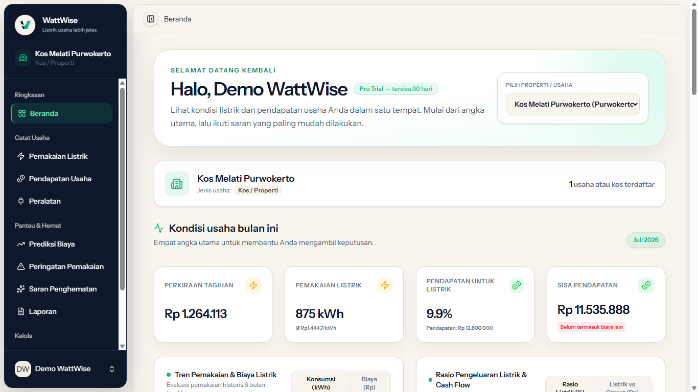
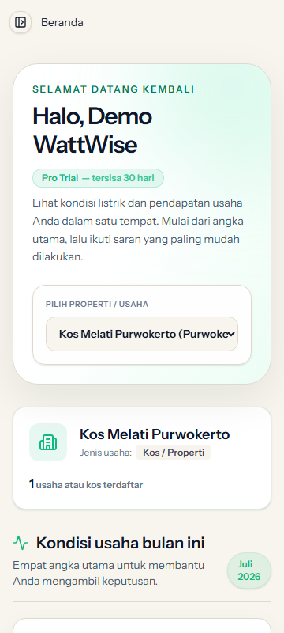
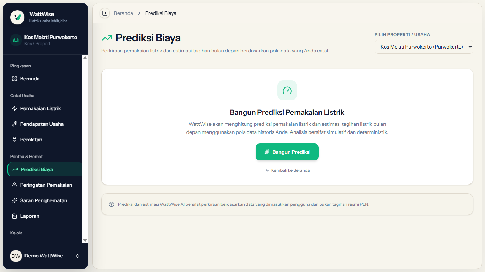
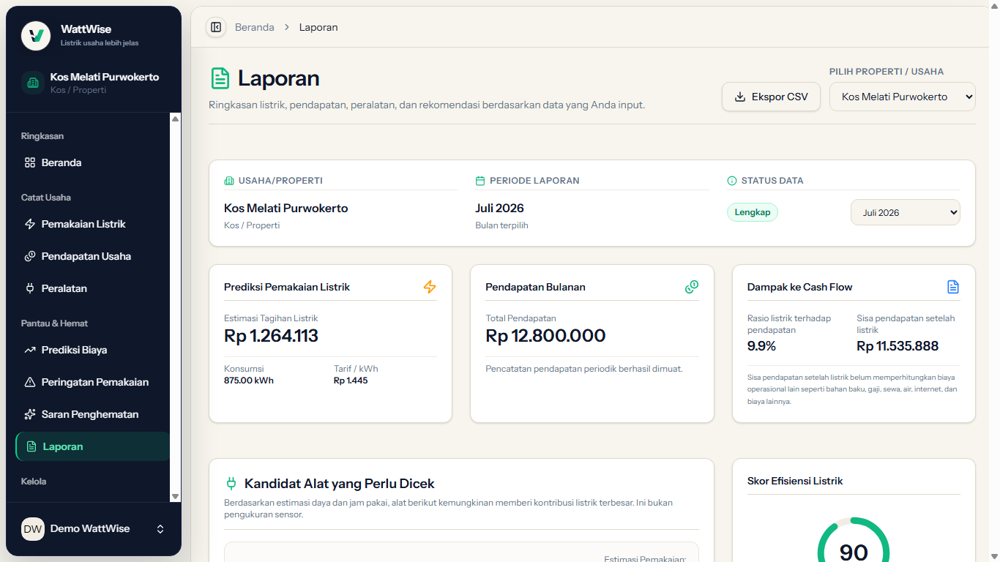
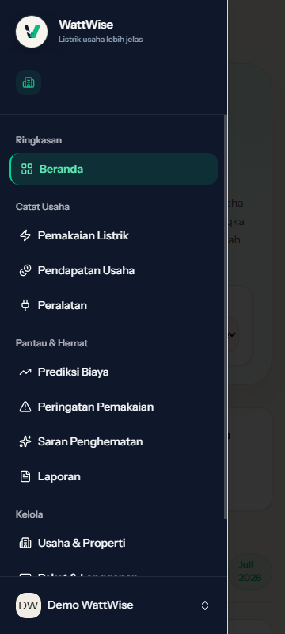
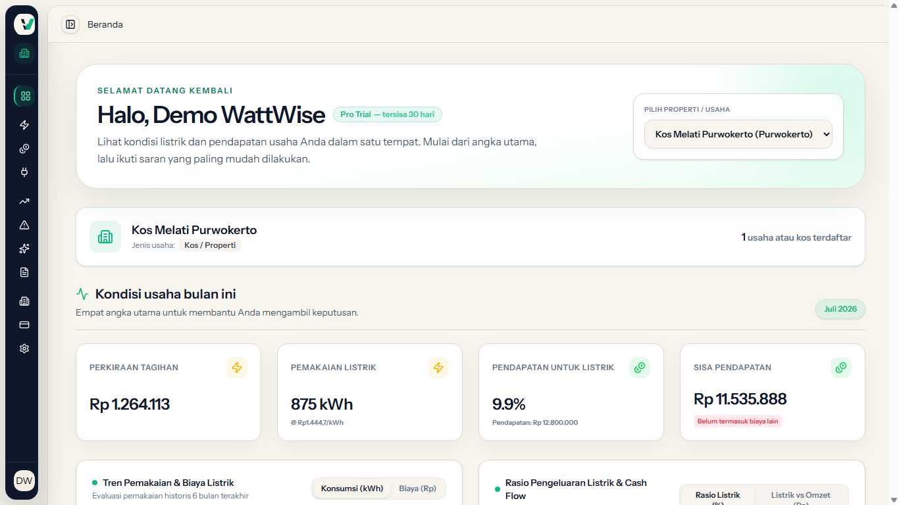

# IT-UI-02: Authenticated App Shell Refresh - Final Report

## Status

PR #17 is **open and draft**. It is **not merged**.

No deployment action was performed or verified in this task. This report makes no deployment claim.

## Project Order and Synchronization

- PR #16 was merged into `main` first.
- PR #16 merge commit: `e6fec37beb0566610d6e12e71e79f65f2c96c5de`.
- Branch `feature/authenticated-app-shell-refresh` was synchronized by merging `origin/main`.
- Synchronization commit: `3023a428ce4413f286d9fe22cb8c0765837bade4`.
- No rebase or history rewrite was used.
- The merge completed without conflicts.

## Implemented Scope

- WattWise branding replaces Laravel-facing branding in the authenticated experience.
- The authenticated shell uses a grouped sidebar, sticky top bar, responsive mobile drawer, and collapsed icon-only sidebar.
- Navigation labels use plain-language Indonesian terminology.
- Active navigation, focus states, semantic landmarks, reduced motion, and keyboard behavior were improved.
- Dashboard and authenticated pages use consistent semantic light/dark design tokens.
- Prediction/report method labels use "Analisis Tren & Rata-Rata Bergerak".
- Routes, controllers, database migrations, billing behavior, authentication behavior, prediction algorithms, and ML runtime flags were not changed by the UI work.

## Validation After Synchronization

| Check | Result |
|---|---|
| Full PHPUnit suite | **734/734 passed**, 4,130 assertions, 0 failures, 0 errors |
| `npx vue-tsc --noEmit` | Pass |
| `npm run build` | Pass |
| `git diff --check` | Pass |

The PHPUnit run used a cryptographically generated, process-scoped `APP_KEY`. It was removed when the process ended and was never printed, saved, or committed.

## Real Light-Mode QA

Chrome headless CDP used:

```text
Emulation.setEmulatedMedia
media: screen
prefers-color-scheme: light
```

The run asserted all of the following before every light screenshot:

- `matchMedia('(prefers-color-scheme: light)').matches === true`
- the root element did not contain the `dark` class
- `document.documentElement.scrollWidth <= clientWidth`

All 20 page/viewport combinations passed:

| Page | 360x800 | 768x1024 | 1366x768 | 1920x1080 |
|---|---:|---:|---:|---:|
| Dashboard | Pass | Pass | Pass | Pass |
| Usaha & Properti | Pass | Pass | Pass | Pass |
| Pemakaian Listrik | Pass | Pass | Pass | Pass |
| Prediksi Biaya | Pass | Pass | Pass | Pass |
| Laporan | Pass | Pass | Pass | Pass |

Authenticated login, the mobile drawer, collapsed sidebar, and keyboard focus states were also captured successfully.

## Screenshot Evidence

### Dashboard - light, 1366x768



### Dashboard - light, 360x800



### Prediksi Biaya - light, 1366x768



### Laporan - light, 1366x768



### Mobile drawer - light, 360x800



### Collapsed sidebar - light, 1366x768



## Final Assessment

The UI implementation and post-synchronization validation are complete. PR #17 remains draft and unmerged pending normal project review. No production or deployment state is inferred from GitHub/Vercel status checks.
